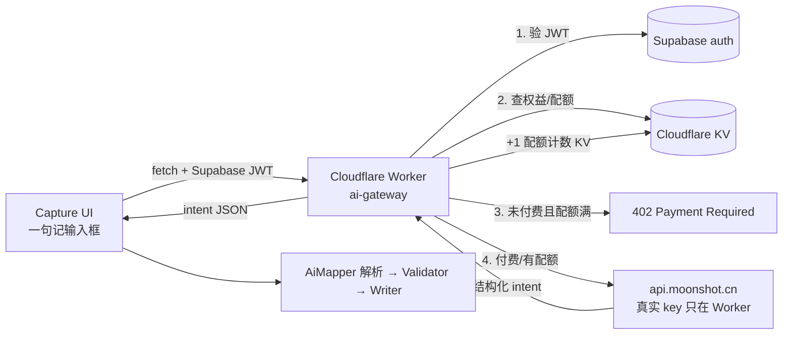

# AI Gateway · AI 网关 · 蓝图

> **AI 接入、token 保护、试用配额、付费门闩** — 为 capture（一句记）及日后其它 LLM 能力提供统一底座。  
> **本关做哪一段** 由 [`current.md`](../current.md) 定；本文件描述完整能力，不替代 current 的选型。  
> 一句记能力见 [`7-capture.md`](./7-capture.md)；收费队列见 roadmap「收费 + 推广」。

---

## 1. 名字与一句话

| 层 | 定稿 |
|----|------|
| 用户向 | （无独立入口；被一句记等功能间接使用） |
| 域名 / 代码 | `ai-gateway` |
| 本文件 | `8-ai-gateway.md` |

> 前端只持 Supabase JWT，经 **Cloudflare Worker** 调 LLM；真实厂商 key 永不进客户端；登录账号有月度试用配额，付费权益走 entitlement seam。

---

## 2. 为何需要（背景）

过去「三脚猫」侧边栏 AI（v0.4.2）的做法：

| 做法 | 后果 |
|------|------|
| Moonshot key 硬编码在 `useSettingStore` 默认 profile，打进 JS bundle | 任何人解包即得，额度被盗刷 |
| Tauri `chat_completion` 只是转发，优先用前端传来的 `api_key` | 不是隐藏，只是桌面端中继 |
| 无额度计数；靠共享池被刷光当「限流」 | 无法按用户隔离，无法做试用 |
| 付费 = 手动 49 元/6 个月腾讯文档表单 | 无程序化门闩 |

**结论：** 重接 Kimi（或任何厂商）前，必须先有 **隐藏 key 的代理 + 登录配额 + 付费门闩**，否则新 key 仍会被刷光。

---

## 3. 架构总览



**决策（已定）：**

1. **代理层**：Cloudflare Worker（真实 key 只存 Worker secret）
2. **试用配额**：必须登录（复用 Supabase auth），按账号按月发配额
3. **支付渠道**：本蓝图只留 entitlement seam；真实支付留给收费关

---

## 4. Cloudflare Worker 设计

### 4.1 路由

| 方法 | 路径 | 用途 |
|------|------|------|
| `POST` | `/v1/chat/completions` | OpenAI 兼容透传；便于以后换 provider；旧 AiChat 若启用也可走此路 |
| `POST` | `/capture/map` | capture 专用：请求带 kinds/candidates 上下文，响应为结构化 intent（或厂商原始 JSON，由 AiMapper 再 Zod） |
| `POST` | `/admin/entitlement` | 人工/webhook 写入付费权益；受 Admin token 保护 |

`/capture/map` 可附带 `candidates`（本地摘要）；网关只约定体积上限（建议整段上下文 ≤ 若干千字符，具体数值由 current 定）。候选如何生成、筛哪些字段属 capture 关，不在本文件展开。

### 4.2 Secrets（`wrangler secret put`，不入库）

| Secret | 用途 |
|--------|------|
| `MOONSHOT_API_KEY` | 调 `api.moonshot.cn` 的真实 key |
| `SUPABASE_JWT_SECRET` | 验前端传来的 Supabase JWT |
| `ADMIN_TOKEN` | 保护 `/admin/entitlement`；勿提交入库；可随时 `wrangler secret put` 轮换 |

本地开发用 `.dev.vars`（gitignore），不进 git。联调：`wrangler dev` 起 Worker；前端经 `WORKER_URL`（env 或 settings）指向该地址（如 `http://127.0.0.1:8787`）。

### 4.3 鉴权

1. 从 `Authorization: Bearer <jwt>` 取 token。
2. 用 `SUPABASE_JWT_SECRET` 验签，提取 `sub` 作为 `user_id`。
3. 验不过 → **401**；未带 token → **401**。
4. **仅 email / 第三方登录且已验证** 的账号可走配额与试用；Supabase **anon / 未验证** → 无额度（401 或业务码拒绝），防批量注册薅试用。
5. 前端未登录时 **入口门闩拦截**，原则上不打到 Worker；Worker 仍独立校验，防绕过。

### 4.4 转发、限流与错误体

- 用真实 key 调 Moonshot；响应回传前端；**前端永远拿不到 key**。
- 每用户每分钟 N 次（防刷），KV sliding window；超限 → **429**，body 带 `code`（如 `RATE_LIMITED`）。
- 配额用尽 → **402**，body 须带业务码，例如 `{ "code": "QUOTA_EXHAUSTED", "upgrade_url"?: "…" }`；前端以 `code` 为准，不单靠状态码。
- 厂商超时/失败 → 原样或包装错误码回传；**不降级为规则路径**（对齐 [`7-capture.md`](./7-capture.md) §4.3）。

---

## 5. 试用配额（登录制）

| 项 | 约定 |
|----|------|
| 前提 | 必须登录 Supabase，且为 **已验证** 的 email / 第三方账号（anon 无额度） |
| 额度 | 每用户每月 `FREE_MONTHLY_QUOTA`（初值建议 20 次 capture 成功调用；数值可由 current / 收费关改） |
| KV key | `quota:{user_id}:{YYYY-MM}` |
| 计数 | 每次 **成功** LLM 调用 `+1`（失败不扣，避免用户白耗） |
| 一致性 | KV 最终一致；试用阶段 **允许偶发 ±1 误差**，不为此上 D1；真被刷再迁强一致存储 |
| 超额 | **402** + body `code: QUOTA_EXHAUSTED` + 提示升级 |
| 重置 | 按月 key 自然切换；旧 key TTL ≈ 35 天自动过期 |
| 未登录 / 未验证 | 前端入口拦截，不进 Worker |

---

## 6. 付费门闩（entitlement seam）

### 6.1 存储

KV key：`entitlement:{user_id}`

```text
{ plan: "free" | "premium", until: "<ISO8601>" }
```

### 6.2 Worker 判定

| 状态 | 行为 |
|------|------|
| `plan=premium` 且 `until` 未过期 | 不限免费配额（仍受每分钟限流） |
| 否则 | 走 §5 免费配额 |
| 未登录 / 无 JWT | 401；前端已先拦截 |

### 6.3 开通方式（本阶段）

- **短期**：保留手动腾讯文档表单；人工用 Admin token 调 `POST /admin/entitlement` 写入。
- **预留**：日后 Stripe / LemonSqueezy / 国内支付 webhook → 同一 Admin 接口（或直接写 KV / 日后迁 Supabase 表）。
- **价目表**：不写死在本文件；留给收费关（roadmap「收费 + 推广」）。

前端入口处：检查登录态 +（可选）预检配额/权益；未通过则提示升级，**不进入 LLM 调用** — 对齐 [`7-capture.md`](./7-capture.md) §5.1 第 5 条。

---

## 7. Token 保护清单

| 项 | 说明 | 何时做 |
|----|------|--------|
| 删默认 profile 硬编码 `apiKey` | [`src/stores/useSettingStore.ts`](../../../src/stores/useSettingStore.ts) | 下一关编码 |
| 前端走 Worker | [`aiApiService.ts`](../../../src/services/ai/aiApiService.ts) 新增 `fetch(WORKER_URL, { Authorization: Bearer jwt })`；PWA 必须走 Worker；桌面可走 Worker（推荐统一）或暂留 Tauri invoke | 下一关 |
| 真实 key 只存 Worker | secret + 本地 `.dev.vars`；**禁止**再写进 bundle / localStorage 默认值 | 持续 |
| 旧 AiChatDialog | 保持休眠（`showAi: false`）；若再启用，也走同一 Worker，勿再塞客户端 key | 可选 |

`AiProfile.apiKey` 类型注释「如在前端不存储，留空」应真正落实：默认空；用户自带 key（BYOK）若以后要做，属另案，与本网关试用池分离。

---

## 8. 与 capture 蓝图的接口

```text
Capture 入口
  → 前端门闩：已登录？有配额/权益？（未过 → 提示升级，不调 LLM）
  → AiMapper：POST Worker /capture/map（JWT + 原句 + kinds/candidates）
  → Validator → Writer[kind] → Reporter
```

| 失败码 / 情形 | 前端行为 |
|--------|----------|
| 401 | 引导登录（或提示完成邮箱验证） |
| 402 + `QUOTA_EXHAUSTED` | 提示升级 / 配额用尽 |
| 429 | 提示稍后再试 |
| 网关不可达 / 连接失败 | 不写；提示「暂不可用，稍后重试」 |
| 超时 / 5xx / 厂商错 | 不写；提示重试 / 改写 / 去原界面 |

**不做：** 失败时降级为规则引擎（见 [`7-capture.md`](./7-capture.md) §4.3）。

---

## 9. 代码落点（下一关，本文件不定实施顺序）

| 层 | 文件 | 改动 |
|----|------|------|
| Worker | `worker/ai-gateway/`（新建） | Worker 代码、`wrangler.toml`、KV 绑定 |
| 前端服务 | `src/services/ai/aiApiService.ts` | 加 `captureMap()` 走 Worker |
| 设置 | `src/stores/useSettingStore.ts` | 删硬编码 key；可加 `workerUrl` |
| Capture | `src/core/capture/`（新建） | AiMapper 调 `captureMap` |
| 文档 | `docs/dev-log/current.md` | 收窄下一关为「搭 Worker + 重接 Kimi 测通」等 |

遵守 [`1-architecture-layering.md`](./1-architecture-layering.md)。

---

## 10. 留给收费关的开放问题

- 真实支付渠道选型（Stripe / LemonSqueezy / 国内）
- 价目与 `FREE_MONTHLY_QUOTA`、premium 额度数值定稿
- premium 权益是否从 KV 迁到 Supabase 表（多端一致、可审计）
- 旧 AiChat（三脚猫）是否一并迁移到 Worker 并重新开放

---

## 11. 修订

| 日期 | 备注 |
|------|------|
| 2026-07-30 | 初稿：CF Worker + 登录配额 + entitlement seam；对齐过去 key 硬编码被盗刷的教训 |
| 2026-07-30 | 补丁：业务错误码、已验证账号才发额度、KV 计数容差、本地联调、candidates 体积上限、网关不可达文案 |
