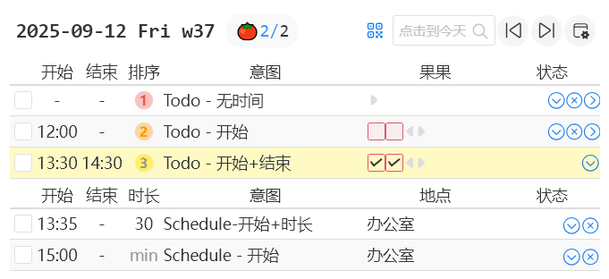
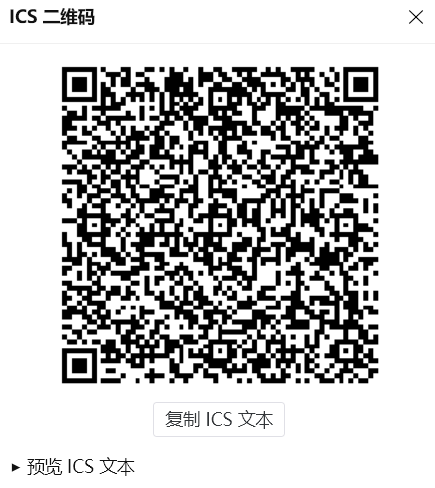
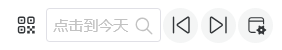
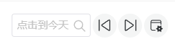
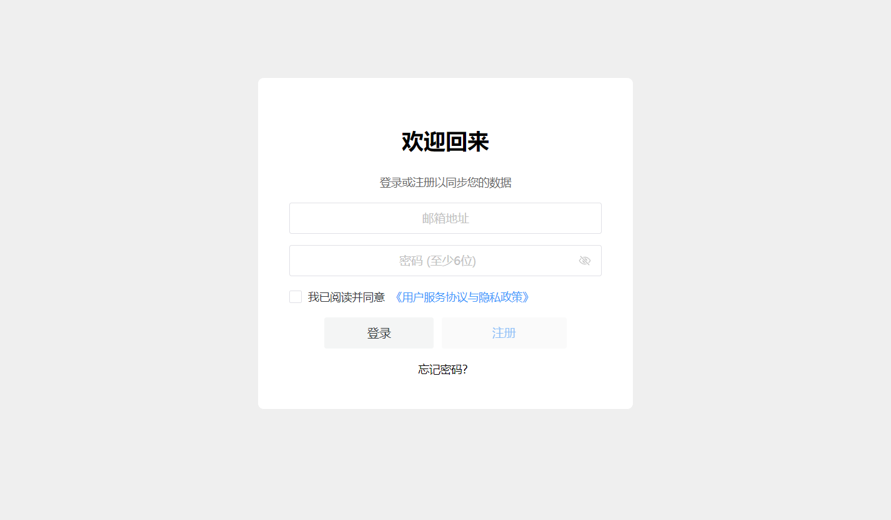
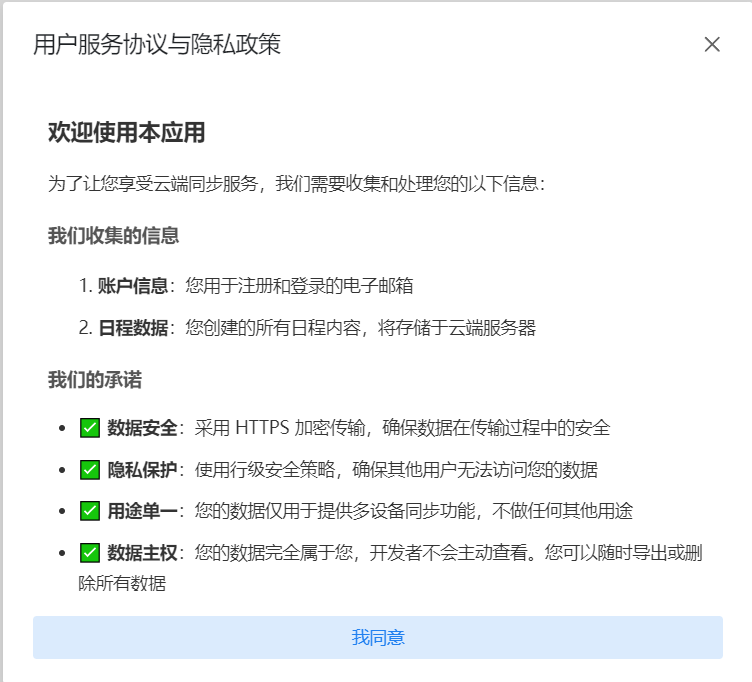

# UI checks

## UI check #1 导出 ics QR 码

### Given

- 任务区域存在数据

### When

- 点击行，选中导出内容
- 点击按钮，弹出 QR 码

### Then

- 高亮行,按钮变为蓝色

- 弹出二维码 20250912-qr-ics-code-after.png

## UI check #2 导出 ics 文件

### Given

- 任务区域存在数据
- 无数据行被选中

### When

- 按钮变为黑色
- 点击按钮，弹出文件选择对话框

### Then

- 黑色按钮

  

- 加入按钮前

  

## UI check #3.1 登录功能

### Given

- 版本 >0.4.4
- 用户在登录页面

### When

- 输入邮箱和密码
- 点击登录按钮

### Then

- 如果邮箱或密码为空，弹出提示"邮箱和密码不能为空"
- 如果填写完整，执行登录操作

## UI check #3.2 注册功能

### Given

- 版本 >0.4.4
- 用户在注册页面

### When

- 输入邮箱和密码
- 勾选/不勾选用户协议
- 点击注册按钮

### Then

- **未勾选协议时**：
  - 注册按钮为灰色
  - 点击提示"请先阅读并同意用户协议"
- **已勾选协议时**：
  - 注册按钮变为蓝色
  - 可以正常注册

## UI check #3.3 忘记密码功能

### Given

- 版本 >0.4.4
- 用户在登录页面

### When

- 点击"忘记密码"链接
- 跳转到重置密码页
- 输入邮箱
- 点击"发送重置链接"按钮

### Then

- 页面跳转到重置密码页
- 输入邮箱后可发送重置链接

