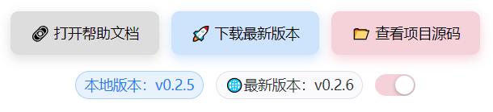

# 快速开始

获取最新版本，体验完整功能，
**关于 AI**： 由于没有想好合适的 API 发放机制，暂时不可用，下一步将优先开发 Dashboard，让历史数据可视化，然后发酵 AI 部分
如果你想[支持 AI 模块开发](https://docs.qq.com/form/page/DZWtGeVpKUkNuQnVL)

## 当前版本

::: info 最新发布
**版本 v0.4.4** - 2025 年 10 月 22 日发布

- **新增**

  - **仪表盘**：显示基础统计数据。
    - 番茄热力图
    - 月度数据变化
    - 全年数值

:::

- [更新日志](dev-log/CHANGELOG.md)

## 系统要求

### Windows

- Windows 10 或更高版本
- 64 位系统

### macOS

- macOS 13.0 (Ventura) 或更高版本
- webkit 支持不完全导致 macOS 12.0 可安装，部分渲染失败
- Intel 或 Apple Silicon 处理器

## 下载链接

- Windows

  - [v0.4.4 .msi 安装包](https://github.com/Xeonilian/pomotention/releases/download/v0.4.4/pomotention_0.4.4_x64_en-US.msi)

- macOS
  - [v0.4.4 .dmg 安装包](https://github.com/Xeonilian/pomotention/releases/download/v0.4.4/pomotention_0.4.4_x64.dmg)

## 安装指南

### Windows 安装

1. 下载 `.msi` 安装包
2. 双击运行安装程序
3. 按照向导完成安装
4. 从开始菜单启动应用

### macOS 安装

1. 下载 `.dmg` 文件
2. 双击打开磁盘映像
3. 将应用拖拽到 Applications 文件夹
4. 从 Launchpad 或 Applications 启动

::: warning 安全设置

- macOS 首次运行时，需要在"系统偏好设置 > 安全性与隐私"中允许应用运行
- Windows 安装时，可能会出现安全警告，请选择“运行”或“更多信息”->“仍然运行”

:::

## 自动更新

- 软件提供自动更新检测，由于网络原因可能下载失败
- 软件帮助页面：
  - 比较本地和云端版本
  - 打开和关闭自动更新
  - 点击下载最新版本，进入最新版本页面
    

## 遇到问题

如果下载或安装过程中遇到问题：

1. **下载失败**：请检查网络连接，或尝试使用下载工具
2. **安装报错**：确认系统版本符合要求，windows7 暂不支持
3. **安装中断**：从`任务管理器`关闭进程后重试安装
