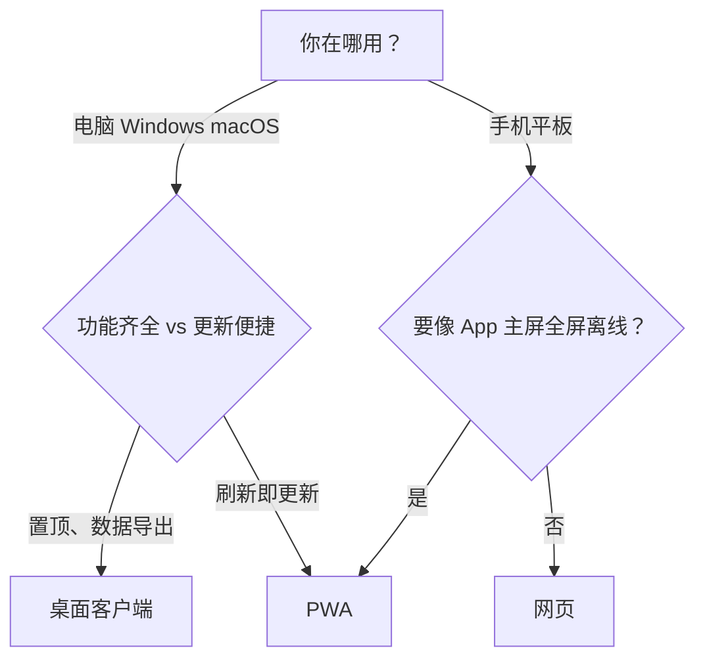
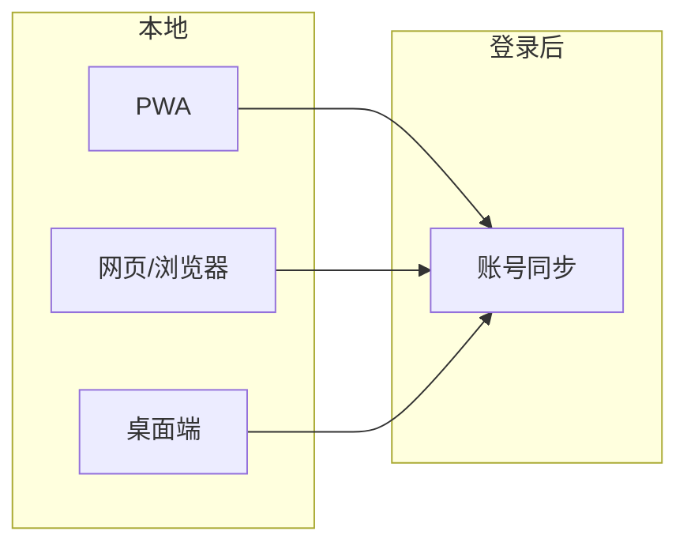

# 快速开始

::: tip

- 先看流程图选方式，再点表格里的入口。
- 不登录时 PWA 与网页数据不互通；多设备一致需登录同步。
- 桌面端支持置顶。
  :::

## 怎么选

```mermaid
flowchart TD
  A[你在哪用？] -->|电脑 Windows macOS| B{功能齐全 vs 更新便捷}
  A -->|手机平板| C{要像 App 主屏全屏离线？}

  B -->|置顶、数据导出| D[桌面客户端]
  B -->|刷新即更新| E[PWA]

  C -->|是| E[PWA]
  C -->|否| F[网页]
```

## 入口

| 方式       | 适合                                 | 链接                                                   |
| ---------- | ------------------------------------ | ------------------------------------------------------ |
| 桌面客户端 | 独立应用、置顶计时、导入导出、换机   | [安装说明](/pc-getting-started.md)                     |
| PWA        | 像 App、更新快                       | [安装说明](/pwa-getting-started.md)                    |
| 网页       | 不安装、[快速使用](/get-things-done) | [pomotention.pages.dev](https://pomotention.pages.dev) |

## 数据与同步

```mermaid
flowchart LR
  subgraph L[本地]
    P[PWA]
    W[网页/浏览器]
    C[桌面端]
  end
  subgraph Cloud[登录后]
    S[账号同步]
  end
  P --> S
  W --> S
  C --> S
```

::: warning

- 不登录：数据只在本地，不自动同步；PWA 与网页数据分开。
- 多设备：各端登录同一账号。
- 数据导出：本地使用仅桌面端支持数据导出。

:::

## 场景对照

- 电脑功能全面：[桌面客户端](/pc-getting-started.md)
- 电脑功能实时更新：[PWA](/pwa-getting-started.md)
- 手机平板、像 App：[PWA](/pwa-getting-started.md)
- 只打开网页：浏览器访问 [pomotention.pages.dev](https://pomotention.pages.dev)

## 名词

- **PWA**：安装到系统的类 App 用法（主屏/独立窗口/常可离线缓存）。
- **网页**：浏览器直接打开，不安装。
- **桌面客户端**：本机安装程序（Windows/macOS）。
- **同步**：登录后云端与多端一致。
