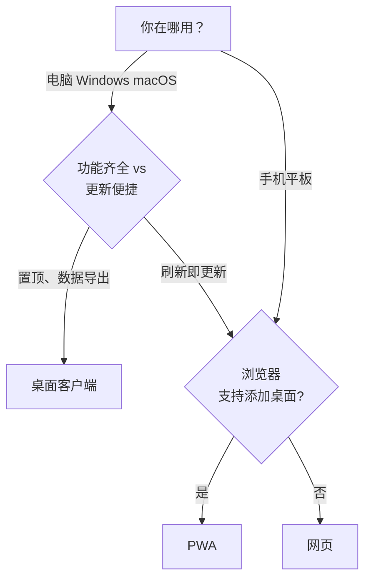
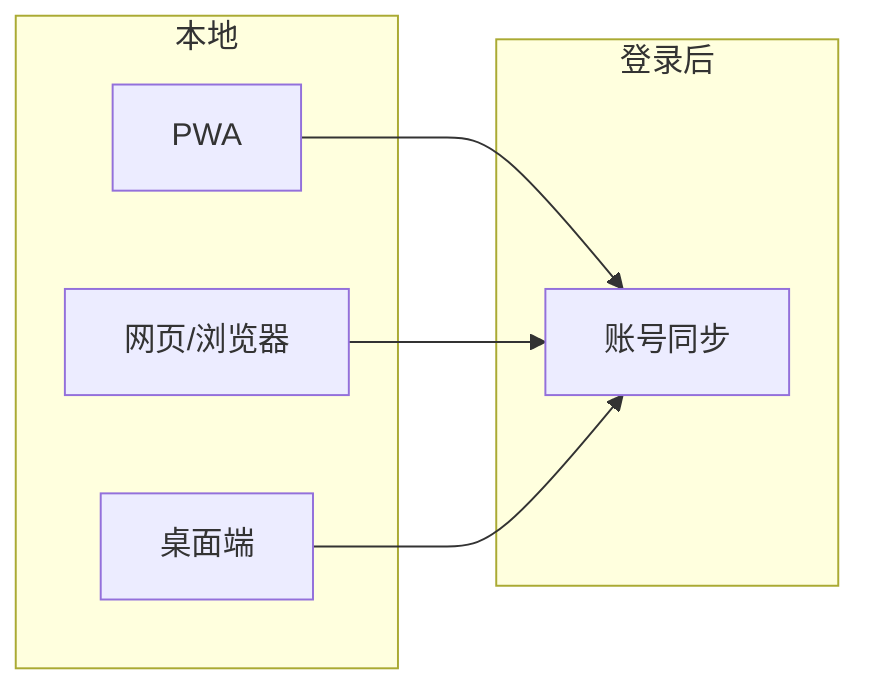

# 安装方式总览

::: tip

- 看流程图选方式，从表格找入口。
- 不登录时 PWA 与网页数据不互通；多设备一致需登录同步。
- 桌面端支持置顶。
  :::

## 怎么选

## 入口

| 方式       | 适合                                        | 链接                                  |
| ---------- | ------------------------------------------- | ------------------------------------- |
| 桌面客户端 | 独立应用、置顶计时、数据导入导出            | [安装说明](./desktop-install.md)   |
| PWA        | 类App、更新及时，支持数据导入，需浏览器支持 | [安装说明](./pwa-install.md)  |
| 网页       | 浏览器打开，不安装、直接使用                | [链接](https://pomotention.pages.dev) |

## 数据与同步

::: warning

- 不登录：数据只在本地，不自动同步；PWA 与网页数据分开。
- 多设备：各端登录同一账号。
- 数据导出：**全量 JSON 导出**仅桌面端支持，详见 [账号与数据](./account-and-data.md)。

:::

## 名词

- **PWA**：安装到系统的类 App 用法（主屏/独立窗口/常可离线缓存）。
- **网页**：浏览器直接打开，不安装。
- **桌面客户端**：本机安装程序（Windows/macOS）。
- **同步**：登录后云端与多端一致。
