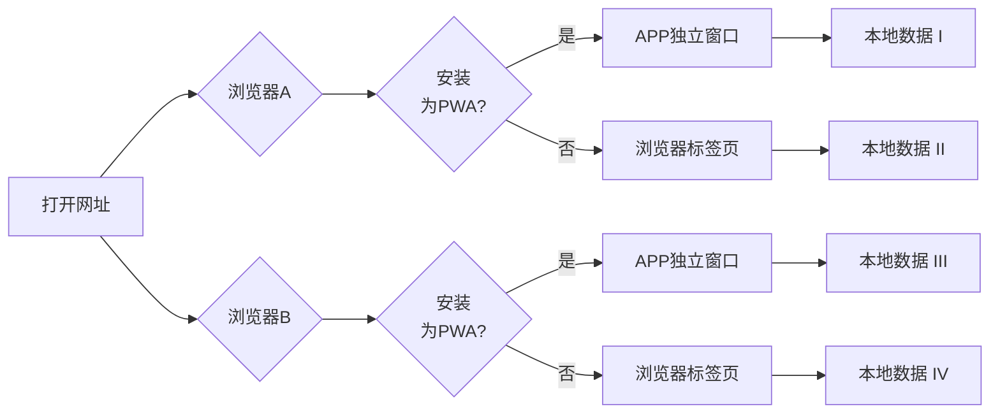
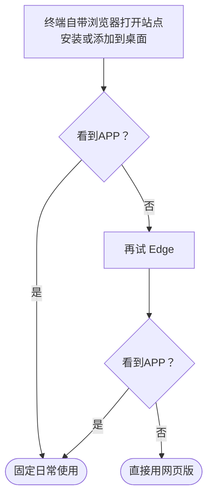
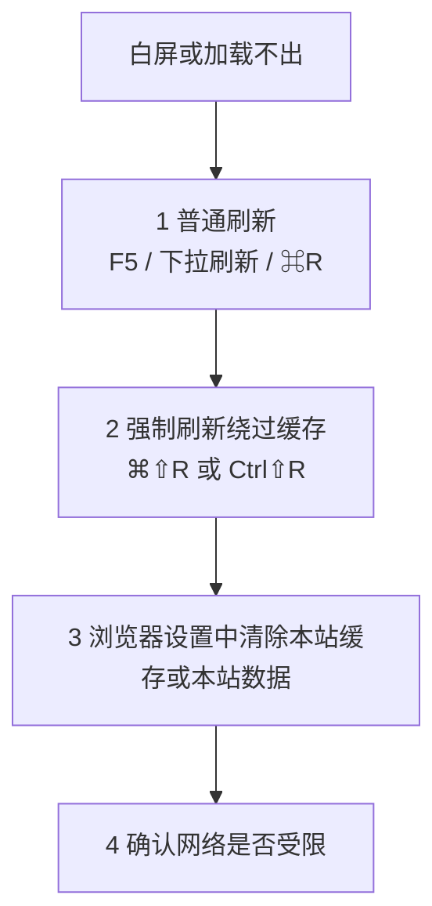

# PWA 快速安装

## 我想...

- [了解 PWA 能否装、装完是否像独立 App](#pwa-expectations)
- [从电脑或手机完成安装](#pwa-install)
- [解决白屏、一直加载、网络或代理问题](#pwa-blank-screen)
- [同步与离线使用](#pwa-data-sync)
- [从桌面端 JSON 迁入或合并数据](#pwa-data-sync)
- [卸载或清空本机数据](#pwa-uninstall)

## 背景与能力边界 {#pwa-expectations}

::: tip

- PWA 能否安装、装完是否像独立 App，取决于**系统与浏览器**是否完整支持相关能力，不是单靠「网址能打开」就能保证。
- 国产手机系统多为 **Android 或兼容 Android 应用生态的深度定制**，自带浏览器也常基于 **Chromium 改版**；菜单名称、安装入口位置与 **类原生 Android + Chrome** 不一定一致。
- 若某浏览器里能看到「安装 / 添加到桌面」类入口，但装完仍是普通网页、或反复失败：**换一款浏览器再试**（优先尝试厂商自带浏览器和 Edge），仍不行就 **直接使用网页版**，不必强装 PWA。

:::

### 网页版与 PWA

- **网页版**：新版本在站点发布后，一般刷新页面即可；若界面异常可尝试强制刷新或清除该站点的浏览数据（与浏览器实现有关）。  
  **最推荐**：使用浏览器将网页安装为 **PWA**（Progressive Web App），再以独立应用形式打开。

- 访问：<https://pomotention.pages.dev>
- 支持 **Service Worker 离线**（在无网或弱网下仍可能打开已缓存的页面）
- 数据首先保存在本地，与是否登录云端无关

::: tip PWA 与「网页标签」不是同一份存储

**同一网址在「仅标签页打开」与「已安装的 PWA」** 对应 **不同的站点存储分区**  
因此：**换了一种打开方式，像「另一份本地数据」**；固定一种主要使用方式（推荐已安装的 PWA）可减少困惑。云端仅共享工作数据，不共享设置数据。

:::

## 安装步骤（按平台） {#pwa-install}

### 电脑：Edge / Safari / Chrome

1. 浏览器打开 <https://pomotention.pages.dev>
2. 在地址栏或菜单中找到 **「安装应用」** / **「安装 Pomotention」** 等入口并完成安装

**常见差异**：

- **Windows**（Edge / Chrome）：通常会明确询问「是否安装此应用」
- **macOS 14+（Safari）**：支持直接安装并保存到 Dock
- **macOS 13.7.8（实测）**：Safari 入口能力受限，建议安装 **Edge** 后使用其 PWA 安装入口

### 手机 / 平板

手机端没有「一项操作适用所有机型」的固定路径，可按下面顺序理解。

#### iPhone / iPad（相对统一）

- 使用 **Safari** 打开站点 → 点 **分享** → **添加到主屏幕**（或系统提供的同类文案）。

#### Android 与国产安卓系定制系统（入口名字、位置都可能不同）

::: details 展开：国产系统与浏览器里常见情况（与类原生环境不完全一致）

许多机型是 **基于 Android 的深度定制**，自带浏览器也常是 **Chromium 改版**，因此：

- 菜单里的说法可能是 **「添加到主屏幕」「安装应用」「添加快捷方式」「加到桌面」「保存到桌面」** 等之一，**不一定和文档或别的手机完全一致**；
- 有的在 **地址栏、「⋮」菜单、分享面板、或浏览器设置** 里才有「安装」相关项，需要自己在当前浏览器里稍微找一下；
- **部分浏览器（例如部分环境下的 Edge）** 可能出现「添加到主屏幕 / 安装」等入口，但受系统策略或浏览器实现影响，**结果只是网页快捷方式、或无法像独立 App 一样打开**——这属于常见现象，**以你手机上实际效果为准**，不必纠结是否「算 PWA」。

:::

#### 建议你这样试（从稳妥到凑合）

1. **优先**：用该机 **官方自带浏览器** 打开 `https://pomotention.pages.dev`，再找上述「安装 / 添加到桌面」类入口。
2. 若自带浏览器没有满意效果，再试 **Edge 或 Chrome**。
3. 若各种浏览器都只能加「快捷方式」、或安装入口形同虚设：**直接使用网页版**即可。
4. 你也可以先试试你常用的浏览器是否支持站点安装，可咨询AI。

## 白屏或一直加载不出来 {#pwa-blank-screen}

若遇到 **白屏、长时间空白、内容不出现**，可按顺序尝试：

1. **普通刷新**：`F5` / 刷新按钮；mac 上常用 `Command + R`；手机上下拉手势
2. **强制刷新（绕过缓存）**：`Command + Shift + R`（mac）或 `Ctrl + Shift + R`（Windows）
3. **清空本站缓存后再打开**：在浏览器设置中清除 **本站数据** 或 **缓存**（你遇到的 mac 白屏，在清空缓存后恢复，即属此类）
4. **确认网络是否受限**:`设置页 → 调试与诊断 → 环境诊断 → 执行检测`，如果连接没有问题，可以等待或换时间再试。

::: tip
**说明（缓存与更新是后台进行的）**：PWA 打开后，**Service Worker** 仍可能在后台 **拉取或更新静态资源**，不等同于「安装完成 = 立刻全部就绪」。刚安装完、或站点刚发版后，可能出现 **短时间**内部分功能异常、或 **资源已到但界面尚未完全跟上**；可先 **等几秒**，再配合第 1～3 步刷新或清缓存。

**iPhone / iPad**：**音频首次经缓存播放** 时，个别情况下会 **无声**；可 **再点一次播放**，或 **关掉页面后重新打开** 再试。
:::

### 网络受限场景（需要代理）

- **确认网络是否受限**:`设置页 → 调试与诊断 → 环境诊断 → 执行检测`，建议先在可更换接入的网络供应商，如不行可尝试开启代理完成一次完整打开
- 等页面加载完成后，再按正常方式安装/打开 PWA
- 首次缓存成功后，后续在离线或弱网场景下通常仍可打开已缓存内容（受缓存是否完整影响）
- 如果依然无法打开，可以将环境诊断信息反馈到 GitHub issue：<https://github.com/Xeonilian/pomotention/issues>

## 卸载、清除本地数据 {#pwa-uninstall}

### 卸载 PWA / 从主屏幕移除

- **Windows**：对已安装的应用图标使用右键 → 卸载（或系统/浏览器提供的卸载入口）
- **macOS**：从程序坞或启动台移除应用（与浏览器/PWA 实现有关，以系统提示为准）
- **手机**：长按主屏幕图标 → 删除应用 / 移除

### 完全删除本地数据并重新开始

1. 在应用内打开 **设置**
2. 使用 **清除所有本地数据** / **重置** 类功能（名称以界面为准）
3. 确认前若需保留数据：PWA **无法在应用内导出** 完整 JSON，请先用**桌面客户端**导出备份，或确认重要内容已由当前登录账号同步至云端

::: tip

若仅想解决缓存导致的显示异常，优先使用刷新与清缓存，不一定需要清空全部数据。

:::

## 数据与同步 {#pwa-data-sync}

::: tip

- **JSON 全量导出**仅桌面客户端提供；PWA 支持 **JSON 导入** 与登录后多端同步。需要离线备份文件时请使用桌面安装版，或依赖云端数据
- 在同一浏览器、同一打开方式（仅标签页或已安装的 PWA）下，刷新或站点更新后通常沿用当前存储分区内的本地数据；主动清除本站数据或换浏览器/换打开方式，会得到独立的本地库（详见上文 **PWA 与「网页标签」不是同一份存储**）
- 登录账号后，可在多端之间同步数据
  :::

### 账号注册与云端同步

- 点击登录按钮，按界面指引进入注册流程
- 使用邮箱完成注册后，登录即可开始与云端同步
- 若本地存在尚未上传至云端的数据，将与云端数据合并
- 登录状态会保持，直至您主动退出登录

### 离线使用

- 未登录时默认为离线模式，功能均可正常使用
- 已登录后若仅需本地、不再使用云端同步：点击账号区域 **退出登录** ，在 **「退出登录时是否保留本地数据？」** 中选择 **保留**

### 数据导入

- 点击数据按钮，打开 **数据库导入导出** 对话框（Web 端不提供 JSON **导出**，仅支持与桌面端相同的导入预览与确认流程）
- 按引导预览数据并选择覆盖策略（浏览器内通过目录选择器选取含 JSON 的文件夹）
- 导入完成后将自动登出；请在确认合并结果无误后，再登录以恢复云端同步
- 若导入结果不符合预期，可再次打开该对话框，点击 **恢复导入前状态**（在提供该按钮时可用）

### 切换登录账号

- 当本次登录的账号与**上一次在本机（当前浏览器存储分区）登录的账号不一致**时，客户端会清空本地业务数据并改为载入新账号的同步数据，避免多账号数据混用
- 更换账号前：PWA 无法导出 JSON，请使用**桌面客户端**按需备份，或确认当前账号数据已可靠同步至云端后再操作
