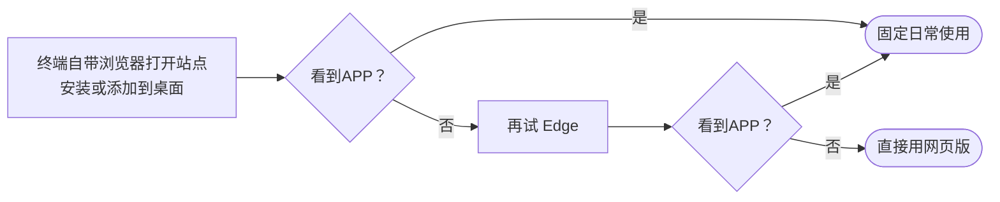
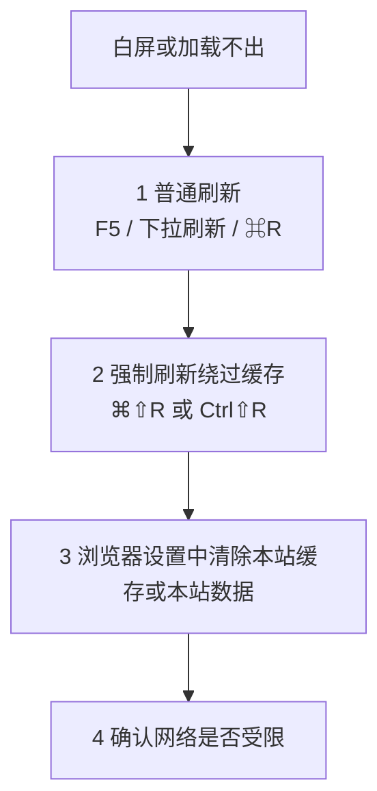
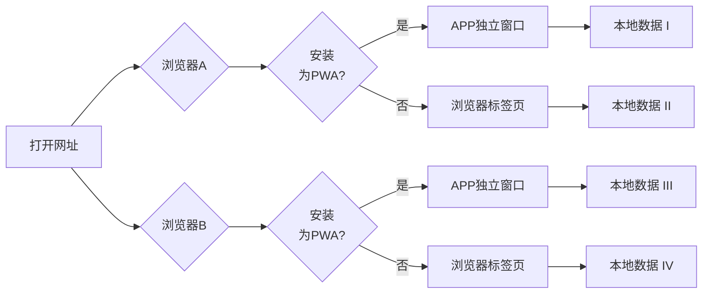

# PWA网页应用说明

在浏览器中打开下面地址，再用浏览器提供的 **「安装应用」** 或 **「添加到主屏幕」** 类入口完成安装即可（不同系统文案略有差异）。

**官方地址**：<https://pomotention.pages.dev>

::: tip 本文怎么读

- **只想装好能用**：读完本节 [安装步骤](#pwa-install) 即可。
- **注册、登录、同步与 JSON**：见 [账号与数据](./account-and-data.md)。
- **卸载应用**：见 [卸载与清除本地数据](#pwa-uninstall)。
- **安装问题排查**：[白屏或加载不出](#pwa-blank-screen) · [装不上或效果不理想](#pwa-expectations)

:::

## 安装步骤 {#pwa-install}

### 电脑：Edge / Safari / Chrome

1. 浏览器打开 <https://pomotention.pages.dev>
2. 在地址栏或菜单中找到 **「安装应用」** / **「安装 Pomotention」** 等入口并完成安装

**常见差异**：

- **Windows**（Edge / Chrome）：通常会明确询问「是否安装此应用」
- **macOS 14+（Safari）**：支持直接安装并保存到 Dock
- **macOS 13.7.8（实测）**：Safari 入口能力受限，建议安装 **Edge** 后使用其 PWA 安装入口

### 手机 / 平板

手机端没有「一项操作适用所有机型」的固定路径，可按下面顺序操作。

#### iPhone / iPad（相对统一）

- 使用 **Safari** 打开站点 → 点 **分享** → **添加到主屏幕**（或系统提供的同类文案）。

#### Android 与国产安卓系定制系统（入口名字、位置都可能不同）

::: details 展开：国产系统里菜单名称、安装入口可能长什么样

许多机型是 **基于 Android 的深度定制**，自带浏览器也常是 **Chromium 改版**，因此：

- 菜单里的说法可能是 **「添加到主屏幕」「安装应用」「添加快捷方式」「加到桌面」「保存到桌面」** 等之一，**不一定和文档或别的手机完全一致**；
- 有的在 **地址栏、「⋮」菜单、分享面板、或浏览器设置** 里才有「安装」相关项，需要自己在当前浏览器里稍微找一下；
- **部分浏览器（例如部分环境下的 Edge）** 可能出现「添加到主屏幕 / 安装」等入口，但受系统策略或浏览器实现影响，**结果只是网页快捷方式、或无法像独立 App 一样打开**——以你手机上实际效果为准。

:::

#### 建议你这样试（从稳妥到凑合）

1. **优先**：用该机 **官方自带浏览器** 打开 `https://pomotention.pages.dev`，再找「安装 / 添加到桌面」类入口。
2. 若自带浏览器没有满意效果，再试 **Edge 或 Chrome**。
3. 若各种浏览器都只能加「快捷方式」、或没有可用安装入口：**用浏览器直接打开网页使用**即可。

::: details 可选：手机端「先试自带浏览器 → 再试 Edge」流程图

:::

## 卸载、清除本地数据 {#pwa-uninstall}

### 卸载 PWA / 从主屏幕移除

- **Windows**：对已安装的应用图标使用右键 → 卸载（或系统/浏览器提供的卸载入口）
- **macOS**：从程序坞或启动台移除应用（与浏览器/PWA 实现有关，以系统提示为准）
- **手机**：长按主屏幕图标 → 删除应用 / 移除

### 完全删除本地数据并重新开始

1. 在应用内打开 **设置**
2. 使用 **清除所有本地数据** / **重置** 类功能（名称以界面为准）
3. 确认前若需保留数据：PWA **无法在应用内导出** 完整 JSON，请先用 [桌面端导出](./account-and-data.md#json-export-desktop) 备份，或确认重要内容已由当前登录账号同步至云端

::: details 展开：只想解决界面异常、不一定要清空全部数据

若仅是缓存导致的显示异常，优先使用 [白屏或加载不出](#pwa-blank-screen) 中的刷新与清本站缓存，不一定需要「清除所有本地数据」。

:::

## 白屏或一直加载不出来 {#pwa-blank-screen}

若遇到 **白屏、长时间空白、内容不出现**，按顺序尝试：

1. **普通刷新**：`F5` / 刷新按钮；mac 上常用 `Command + R`；手机上下拉手势
2. **强制刷新（绕过缓存）**：`Command + Shift + R`（mac）或 `Ctrl + Shift + R`（Windows）
3. **清空本站缓存后再打开**：在浏览器设置中清除 **本站数据** 或 **缓存**
4. **确认网络是否受限**：应用内 `设置 → 调试与诊断 → 环境诊断 → 执行检测`；若仍异常，可换网络或稍后再试

::: details 可选：排查顺序流程图

:::

### 网络受限场景（需要代理）

- 在 `设置 → 调试与诊断 → 环境诊断` 中执行检测；可先换接入方式，必要时用代理完成**一次**能完整打开站点的加载
- 页面能正常打开后，再按 [安装步骤](#pwa-install) 安装或使用 PWA
- 若仍无法打开，可将环境诊断信息发到：<https://github.com/Xeonilian/pomotention/issues>

::: details 展开：缓存、发版与 Service Worker 可能导致「刚打开时短暂异常」

- 打开 PWA 后，**Service Worker** 仍可能在后台更新静态资源，**不等于**装完立刻全部就绪；发版后不久可 **多等几秒** 再配合刷新或清缓存。
- **iPhone / iPad**：音频首次经缓存播放时，个别情况会无声；可再点一次播放，或关页重开。

:::

## 装不上或效果不理想 {#pwa-expectations}

**可先做：**

1. **换一款浏览器再试**（优先厂商自带浏览器、**Edge**）。
2. 若始终装不成、或装完仍像普通网页：**不要强装**，直接用 **浏览器打开** <https://pomotention.pages.dev> 使用即可。

::: details 展开：为什么「能打开网址」不等于「一定能装成独立 App」

- 能否安装、装完是否像独立 App，取决于 **系统与浏览器** 是否完整支持相关能力。
- 国产手机系统多为 **Android 深度定制**，自带浏览器也常是 **Chromium 改版**；菜单名称、安装入口与 **类原生 Android + Chrome** 不一定一致。
- **网页版**：站点发版后一般 **刷新** 即可用新版本；界面异常时可强制刷新或清除该站数据（与浏览器有关）。

:::

::: details 展开：网页版、PWA、本地与离线（背景说明）

- **网页版**：浏览器地址栏打开站点即可。
- **PWA**：用浏览器的「安装应用 / 添加到主屏幕」装好后，常用 **独立窗口** 打开（以实际效果为准）。
- **离线**：依赖 **Service Worker** 缓存，无网或弱网下**可能**仍能打开已缓存页面，**不保证**每次完整可用。
- **数据**：默认先存**本地**；登录后与云端同步工作数据。下面示意图说明：**同一网址**在「仅标签页」与「已装 PWA」可能对应 **不同本地存储分区**。

:::
