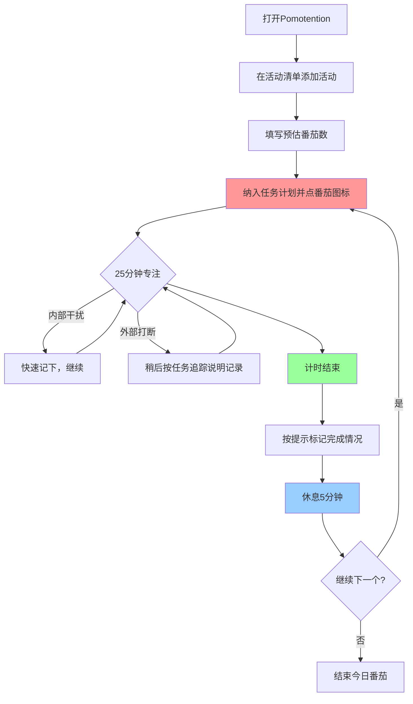

# 从这里开始

你的第一个番茄，从现在开始。

> 分区与控件名称以 [软件界面](../reference/interface.md) 为准；尚未安装见 [安装方式总览](../intro/install-overview.md)。想先随便转转、找条容易的上手方式，见 [轻松上手](../intro/easy-onboarding.md)。

---

## 什么是番茄工作法

番茄工作法的核心很简单：

1. **选一个任务**
2. **设一个 25 分钟计时器**
3. **专注工作，直到计时器响**
4. **休息 5 分钟**
5. **重复**

每 4 个番茄后，休息 15-30 分钟。

这 25 分钟叫做**一个番茄**，是这套方法的基本单位。

---

## Pomotention 如何对应到界面

纸笔流程在软件里的落点（与 [软件界面](../reference/interface.md) 一致）：

- **活动清单** —— 右侧面板，存放所有活动
- **任务计划** —— 中间偏上，选择当日要做的活动（日 / 周 / 月视图）
- **番茄时钟** —— 可拖动悬浮层或迷你置顶模式（见 [番茄时钟](../reference/timer.md)）
- **任务追踪** —— 中间偏下，记录精力、打扰与完成情况
- **时间表** —— 左侧面板，把番茄块对齐到一天的时间轴（可选）
- **书写模板** —— 在任务追踪等流程中使用（见 [任务追踪](../reference/task.md)）

---

## 你的第一个番茄（约 5 分钟上手）

### 步骤 1：添加一个活动

1. 打开 Pomotention，在首页**右侧面板**的 **活动清单** 输入框输入一件今天要做的小事（如「回复一封邮件」）
2. 按回车添加

### 步骤 2：填写预估番茄数

1. 在该活动上找到 **预估番茄数** 编辑入口（详见 [活动清单](../reference/activity.md)）
2. 先填 `1`，不必纠结准确度

### 步骤 3：开始计时

1. 将该活动纳入 **任务计划**（当日视图），点击活动旁的**番茄图标**开始计时（见 [任务计划](../reference/planner.md)、[番茄时钟](../reference/timer.md)）
2. 计时进行中时，窗口标题等区域会显示剩余时间

### 步骤 4：专注工作

- 这 25 分钟内只专注这一件事
- 临时想到别的事，先记在便签上，不要切换去做
- 被人打断时，稍后在 **任务追踪** 里按说明记录（见 [任务追踪](../reference/task.md)）

### 步骤 5：计时结束

1. 计时结束后按界面提示完成记录
2. 短休息约 5 分钟（走动、喝水，尽量少刷手机）

恭喜，你完成了第一个番茄。

---

## 新手流程图

---

## 今天完成 3 个番茄

不要贪多。第一天的目标是：**完成 3 个番茄**。

完成 3 个后，观察：
- 哪些任务比预想的花时间？
- 被打断了几次？
- 什么时候效率最高？

这些观察会帮助你进入 [第一阶段：记录时间](01-track-time.md)。

---

## 下一步

准备好深入了解？前往 [01-track-time.md](01-track-time.md)，学习如何通过记录弄清真实的时间消耗。
