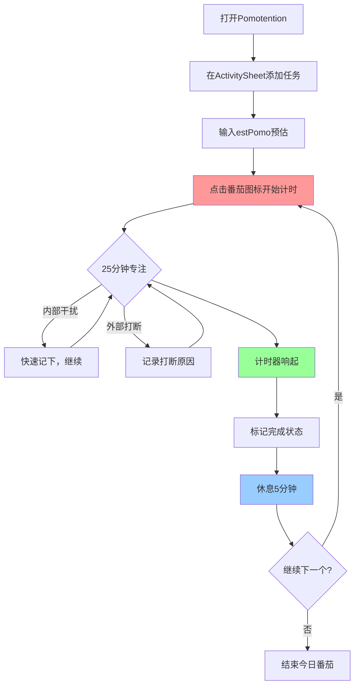

# 从这里开始

你的第一个番茄，从现在开始。

---

## 什么是番茄工作法

番茄工作法的核心很简单：

1. **选一个任务**
2. **设一个 25 分钟计时器**
3. **专注工作，直到计时器响**
4. **休息 5 分钟**
5. **重复**

每 4 个番茄后，休息 15-30 分钟。

这 25 分钟叫做**一个番茄**，是这套方法的基本单位。

---

## Pomotention 如何帮你

Pomotention 把纸笔流程数字化，提供：

- **ActivitySheet（活动清单）** —— 存放所有任务
- **DayPlanner（今日待办）** —— 选择今天要做的任务
- **番茄计时器** —— 内置 25/5 分钟计时
- **TaskTracker** —— 记录完成情况、精力、干扰
- **TimeTable** —— 可视化你的日程安排
- **书写模板** —— 内置 CBT 写作辅助（软件独有功能）

---

## 你的第一个番茄（5 分钟完成）

### 步骤 1：添加一个任务

1. 打开 Pomotention，左侧是 **ActivitySheet（活动清单）**
2. 点击输入框，输入一个今天要做的小任务，比如"回复邮件"或"读 5 页书"
3. 按回车添加

### 步骤 2：预估番茄数

1. 在新添加的任务上，找到 **estPomo** 输入框
2. 输入你猜测完成这个任务需要几个番茄（先猜 1 个）

### 步骤 3：开始计时

1. 点击任务旁的**番茄图标**（或右键选择"开始番茄"）
2. 计时器开始 25 分钟倒计时
3. 窗口标题会显示剩余时间

### 步骤 4：专注工作

- 这 25 分钟内，只专注于这个任务
- 如果突然想到别的事（比如"要买牛奶"），快速记在便签上，不要去做
- 如果被人打断，记录一下，稍后处理

### 步骤 5：计时结束

1. 计时器响起，立即停止工作
2. 在弹出的记录窗口中标记这个番茄是否完成
3. 休息 5 分钟（走动、喝水、看窗外，不要看手机）

恭喜，你完成了第一个番茄。

---

## 新手流程图

---

## 今天完成 3 个番茄

不要贪多。第一天的目标是：**完成 3 个番茄**。

完成 3 个后，观察：
- 哪些任务比预想的花时间？
- 被打断了几次？
- 什么时候效率最高？

这些观察会帮助你进入[第一阶段：记录时间](01-track-time.md)。

---

## 下一步

准备好深入了解？前往 [01-track-time.md](01-track-time.md)，学习如何通过记录弄清真实的时间消耗。
