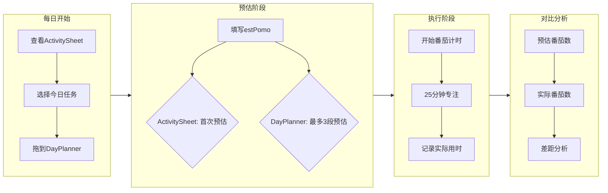

# 第一阶段：记录时间

**目标**：弄清完成一件事到底需要多久。

---

## 为什么要记录

大多数人的时间感是模糊的：
- "回复邮件，应该很快吧"
- "写报告，大概一两个小时"

**实际情况往往和想象差很远。**

记录时间的目的是建立对任务的**真实感知**，而不是模糊的猜测。

---

## Pomotention 的记录系统

### ActivitySheet：活动清单（长期任务池）

- **位置**：软件左侧
- **用途**：存放所有你想做的任务，不限于今天
- **功能**：支持当天筛选，查看历史任务

**使用方法**：
1. 想到什么任务，就添加到这里
2. 为每个任务填写 **estPomo**（预估番茄数）
3. 任务完成后会自动归档

### DayPlanner：今日待办（当天执行）

- **位置**：软件中间区域
- **用途**：从活动清单中选择今天要做的任务
- **特点**：与 ActivitySheet 数据同步

**使用方法**：
1. 每天早上（或前一天晚上）从 ActivitySheet 选择任务
2. 在 DayPlanner 中可以进行**最多 3 段预估**（estPomo）
3. 执行任务时，番茄计时与这里关联

### 番茄计时器：实际记录

- **启动方式**：点击任务旁的番茄图标
- **默认时长**：25 分钟工作 + 5 分钟休息
- **记录内容**：完成后自动记录实际用时

---

## 第一阶段操作流程

---

## 记录循环：从预估到实际

### 1. 初次预估（ActivitySheet）

在 ActivitySheet 中添加任务时，填写 **estPomo** 字段：

- 这是你**第一反应**的猜测
- 不要思考太久，凭直觉
- 记录格式：数字（如 2 表示预估 2 个番茄）

### 2. 多段预估（DayPlanner）

将任务拖到 DayPlanner 后，可以细化预估：

- **最多 3 段预估**：表示任务可以分为 1-3 个部分
- 每段对应一个番茄数
- 例如：写报告 = 第一段（构思，1番茄）+ 第二段（写作，2番茄）+ 第三段（修改，1番茄）

> **注意**：ActivitySheet 和 DayPlanner 的预估数据是同步的，修改一边会更新另一边。

### 3. 实际记录（TaskTracker）

完成番茄后，点击 **TaskButton** 弹出记录窗口：

- 标记番茄是否完成（完整/部分/未完成）
- 记录实际用时
- 系统自动对比预估 vs 实际

---

## 记录数据看哪里

### 当日记录

DayPlanner 本身就是**当日记录**的数字化实现：
- 显示今天计划了什么
- 显示实际完成了什么
- 显示预估与实际的差距

### 历史记录

- **SearchView**：搜索历史任务和记录
- **StatisticView**：查看统计数据
- **ChartView**：可视化趋势变化

---

## 第一阶段的常见问题

**Q: 预估不准怎么办？**  
A: 正常。第一阶段的目标就是发现"不准"，记录一段时间后你会越来越准。

**Q: 任务只做了一部分怎么办？**  
A: 在 TaskTracker 中标记为"部分完成"，记录实际用时，剩余部分下次继续。

**Q: 一个番茄做不完一个任务怎么办？**  
A: 大任务拆分。在 DayPlanner 中使用多段预估，把任务拆成 1-3 个部分。

---

## 什么时候进入下一阶段

当你：
- 能较准确地预估简单任务的番茄数
- 养成了"开始任务前先预估"的习惯
- 有了 1-2 周的数据记录

就可以进入 [02-handle-interruptions.md](02-handle-interruptions.md)，学习如何应对打断。

---

## 本阶段检查清单

- [ ] 每天从 ActivitySheet 选择任务到 DayPlanner
- [ ] 为每个任务填写 estPomo 预估
- [ ] 使用番茄计时器记录实际用时
- [ ] 在 TaskTracker 中标记完成状态
- [ ] 每周查看一次 ChartView，对比预估 vs 实际趋势
