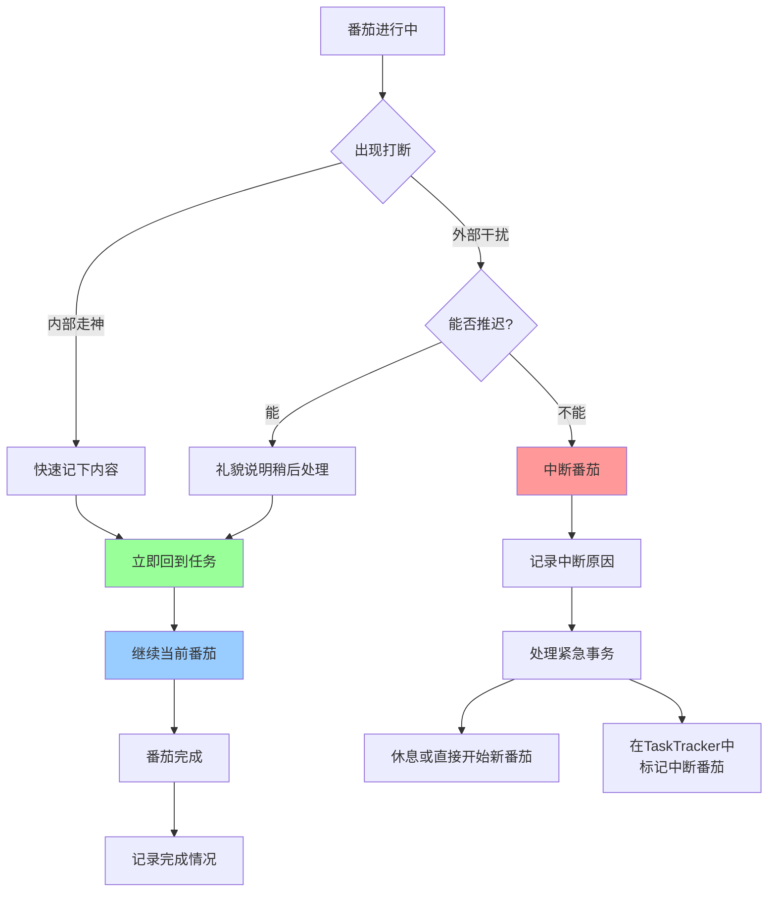

# 第二阶段：应对打断

**目标**：减少打断对专注的影响，学会记录和处理干扰。

---

## 打断的类型

番茄工作法把打断分为两类：

### 内部打断（Internal Interruption）

**特征**：你自己走神的瞬间
- 突然想到"要买牛奶"
- 好奇某个无关紧要的问题
- 想去查个不紧急的信息

**本质**：大脑在逃避当前的困难任务

### 外部打断（External Interruption）

**特征**：来自外界的干扰
- 同事来问问题
- 收到消息通知
- 有人敲门
- 电话响起

---

## Pomotention 的打断记录

在番茄计时过程中，点击 **TaskButton** 可以弹出记录窗口，其中包含打断记录功能。

### 如何记录打断

1. **计时过程中被打断**
   - 不要停止计时器
   - 快速在便签/纸上记下打断内容
   - 如果是 Pomotention 内的任务，直接点击 TaskButton 记录

2. **记录内容**
   - 打断类型：内部 / 外部
   - 打断原因：简要描述（如"想买牛奶"、"同事问问题"）
   - 是否需要处理：现在 / 稍后

3. **回到任务**
   - 记录完立即回到原任务
   - 不要顺着打断内容走

---

## 打断处理决策流程

---

## 保护番茄的策略

### 减少内部打断

1. **接受走神**：走神是正常的，关键是发现后马上回来
2. **快速记下**：用便签纸或软件的快速记录，不要让想法占用大脑内存
3. **CBT 书写模板**：Pomotention 内置的书写模板可以帮助你处理导致走神的焦虑想法

### 减少外部打断

1. **物理隔离**
   - 关闭通知
   - 戴耳机（即使不放音乐）
   - 在门口/座位放"番茄中，请勿打扰"标识

2. **沟通预期**
   - 告诉同事你在用番茄工作法
   - 约定"紧急"的定义
   - 非紧急事项请对方留言或稍后

3. **快速处理**
   - 如果必须打断，记录原因
   - 事后分析这类打断是否可以预防

---

## 打断数据分析

### 在 TaskTracker 中查看

完成番茄后，点击 TaskButton 可以查看：
- 本次番茄的打断次数
- 打断类型分布
- 最常出现的打断原因

### 什么时候打断最多？

通过记录你会发现规律：
- 上午还是下午？
- 什么类型的任务最容易被打断？
- 哪些打断是可以预防的？

### 调整策略

根据数据调整：
- 如果上午被打断多 → 把重要任务移到下午
- 如果某类任务总被打断 → 拆分成更小的番茄
- 如果外部打断多 → 加强隔离措施

---

## 中断的番茄怎么处理

如果一个番茄被紧急事务中断（无法推迟）：

1. **立即停止计时**
2. **在 TaskTracker 中标记为"中断"**
3. **记录中断原因**
4. **处理紧急事务**
5. **休息或直接开始新番茄**（这个番茄作废，不算入统计）

> **规则**：被中断的番茄**不算完成**，不能休息。要么完成一个完整番茄，要么作废重新开始。

---

## 本阶段检查清单

- [ ] 每个番茄都记录打断次数和类型
- [ ] 内部打断快速记下，不跟随
- [ ] 外部打断尽量推迟到番茄结束
- [ ] 每周回顾打断数据，寻找规律
- [ ] 根据数据调整工作环境和时间安排

---

## 什么时候进入下一阶段

当你：
- 能区分内部和外部打断
- 形成了"记录但不跟随"的习惯
- 打断次数明显减少或至少被记录

进入 [03-estimate-tasks.md](03-estimate-tasks.md)，学习如何提高预估准确度。
