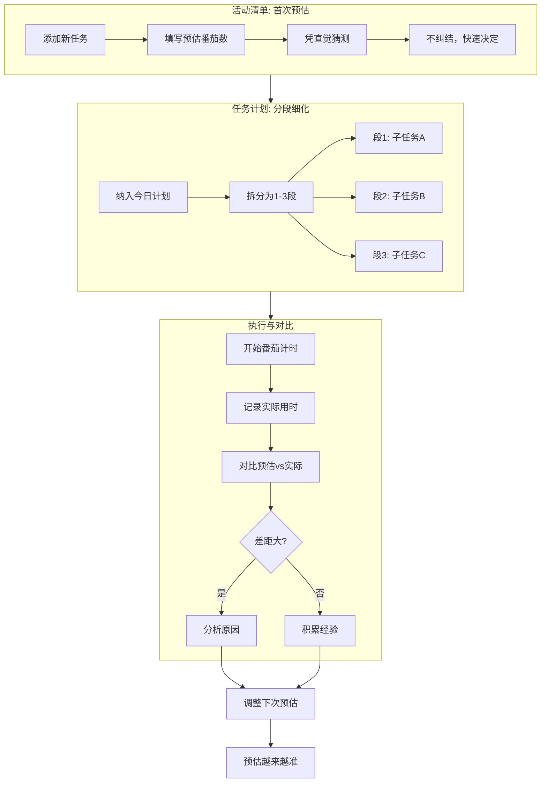

# 第三阶段：估测任务

**目标**：学会较准确地预测任务需要多少番茄。

> 预估字段与分段规则以 [活动清单](../reference/activity.md)、[任务计划](../reference/planner.md) 为准。

---

## 为什么预估重要

预估不是瞎猜，而是：
- **计划的基础**：知道任务要多久，才能合理安排一天
- **信心的来源**：准确的预估带来完成任务的掌控感
- **改进的依据**：通过对比预估vs实际，发现认知偏差

---

## Pomotention 的预估系统

### 两级预估机制

#### 1. 活动清单：首次预估（预估番茄数）

**位置**：活动清单的任务条目（见 [活动清单](../reference/activity.md)）

**用途**：
- 添加任务时的第一反应
- 长期任务的总体预估

**填写建议**：
- 凭直觉，不要纠结
- 记录第一反应的预估
- 可以之后根据实际数据调整

#### 2. 任务计划：分段预估（最多 3 段）

**位置**：任务计划视图中的任务卡片（见 [任务计划](../reference/planner.md)）

**用途**：
- 细化今日要执行的任务
- 把大任务拆分为 1-3 个部分
- 每部分独立预估番茄数

**操作**：
1. 将任务从活动清单纳入任务计划（拖拽或等价操作，以界面为准）
2. 点击任务卡片展开
3. 在预估区域添加最多 3 段预估
4. 每段填写预估番茄数

**数据同步**：
- 活动清单与任务计划中的预估是同步的
- 修改一边，另一边自动更新
- 首次预估作为默认值，分段预估细化执行计划

---

## 预估工作流程

---

## 预估技巧

### 1. 先猜再算

不要先分析再预估，而是：
- 第一反应写下一个数字
- 然后简单想想是否合理
- 不合理再调整

### 2. 从简单任务开始

预估的准确度提升需要时间：
- 先做你熟悉的重复性任务
- 这类任务的预估最容易准
- 积累信心后再预估复杂任务

### 3. 记录预估偏差

在任务追踪中，系统会自动对比：
- 预估番茄数
- 实际番茄数
- 偏差比例

**常见偏差模式**：
- **乐观偏差**：总是预估太少（"这个很快"）
- **悲观偏差**：总是预估太多（"保险起见"）
- **任务膨胀**：做着做着发现任务变大了
- **意外干扰**：低估了打断的影响

### 4. 处理不确定任务

对于完全不熟悉的任务：
- 预估时标注"不确定"
- 先做一个"探索番茄"（只了解任务，不完成）
- 探索后再做正式预估

---

## 预估vs实际对比

### 在数据趋势中查看

在 [数据趋势](../reference/chart.md) 与「仪表盘」等入口（见 [软件界面](../reference/interface.md)）可查看：
- 预估准确度趋势图
- 不同类型任务的预估偏差
- 长期改进曲线

### 分析维度

1. **按任务类型**
   - 哪类任务预估最准？
   - 哪类总是偏差很大？

2. **按时间段**
   - 上午的预估准还是下午？
   - 疲劳时预估是否更不准？

3. **按复杂度**
   - 小任务（1-2番茄）预估是否更准？
   - 大任务是否总是膨胀？

---

## 本阶段检查清单

- [ ] 每个新任务都填写首次预估番茄数
- [ ] 当日任务计划中的任务都进行分段细化（1-3段）
- [ ] 执行后对比预估vs实际
- [ ] 定期查看 [数据趋势](../reference/chart.md) 的预估准确度趋势
- [ ] 根据偏差调整后续预估策略

---

## 什么时候进入下一阶段

当你：
- 对常规任务的预估准确度达到 80% 以上
- 能识别自己的预估偏差模式
- 学会了处理不确定任务的策略

进入 [04-optimize-flow.md](04-optimize-flow.md)，学习如何优化工作流程。
