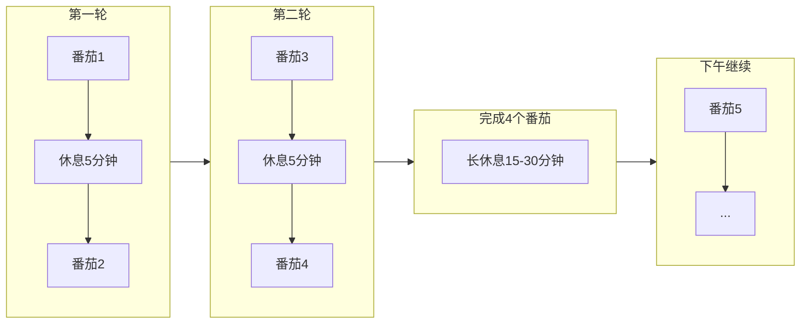

# 第四阶段：优化流程

**目标**：建立可持续的工作节奏，让番茄工作法成为习惯。

---

## 为什么要优化流程

掌握了基础（记录时间、应对打断、预估任务）后，下一步是：
- **找到适合自己的节奏**
- **减少启动阻力**
- **建立条件反射般的习惯**

---

## 番茄结构优化

### 标准结构 vs 个人调整

**标准配置**：
- 工作：25 分钟
- 短休息：5 分钟
- 长休息：15-30 分钟（每 4 个番茄后）

**何时调整**：
- 如果 25 分钟坐不住 → 尝试 15 或 20 分钟
- 如果 25 分钟太短 → 尝试 30 或 45 分钟
- 如果任务类型差异大 → 不同任务用不同时长

### Pomotention 的设置

在 **SettingView** 中可以调整：
- 番茄时长
- 休息时长
- 长休息触发条件

**建议**：先坚持标准配置至少 2 周，再根据个人数据调整。

---

## 轮次安排策略

### 上午 vs 下午

**观察你的能量曲线**：
- 早上精力好？→ 把困难任务放在上午
- 下午效率高？→ 上午处理琐事，下午深度工作
- 中午需要午睡？→ 在 4 个番茄后安排长休息

### 任务类型分组

**同类任务集中处理**：
- 连续处理 2-3 个"回复邮件"番茄
- 避免频繁切换任务类型
- 减少上下文切换成本

---

## 减少启动阻力

### 前一天晚上准备

**使用 DayPlanner 规划次日**：
1. 晚上花 5 分钟选择明天的 3-5 个任务
2. 拖到 DayPlanner 并排序
3. 第二天早上直接开始第一个番茄

### 降低第一个番茄的门槛

**启动策略**：
- 第一个番茄选简单任务（ warm-up ）
- 或选你最想做的任务（ motivation ）
- 避免第一个番茄就是最难的

### 建立启动仪式感

**条件反射训练**：
- 固定番茄开始的动作（如倒杯水、深呼吸）
- 固定工作环境（同一位置、同一设备）
- 固定时间段（如每天早上 9 点第一个番茄）

---

## 流程优化检查点

### 每周回顾

在 **StatisticView** 查看：
- 本周完成了多少番茄？
- 哪天完成最多？为什么？
- 哪天完成最少？原因是什么？
- 打断次数趋势如何？

### 调整策略

根据数据决定：
- 番茄时长是否需要调整？
- 任务安排顺序是否最优？
- 休息时长是否足够恢复？

---

## 优化流程的常见问题

**Q: 4 个番茄后必须长休息吗？**  
A: 不是必须。如果你状态好，可以继续；如果累了，就休息。听从身体信号。

**Q: 可以一天只做 2-3 个番茄吗？**  
A: 完全可以。质量比数量重要。8 个低质量番茄不如 4 个高质量番茄。

**Q: 周末也要用番茄吗？**  
A: 可选。有人周末休息，有人用番茄管理个人项目。找到适合自己的节奏。

---

## 本阶段检查清单

- [ ] 确定了适合自己的番茄时长（可能仍是25分钟）
- [ ] 建立了前一天晚上规划次日的习惯
- [ ] 形成了相对固定的工作节奏
- [ ] 每周查看 StatisticView 分析完成情况
- [ ] 根据数据持续微调流程

---

## 什么时候进入下一阶段

当你：
- 番茄工作法已经成为日常习惯
- 能稳定完成计划的任务量
- 形成了可持续的节奏

进入 [05-build-schedule.md](05-build-schedule.md)，学习如何构建完整的时间表。
