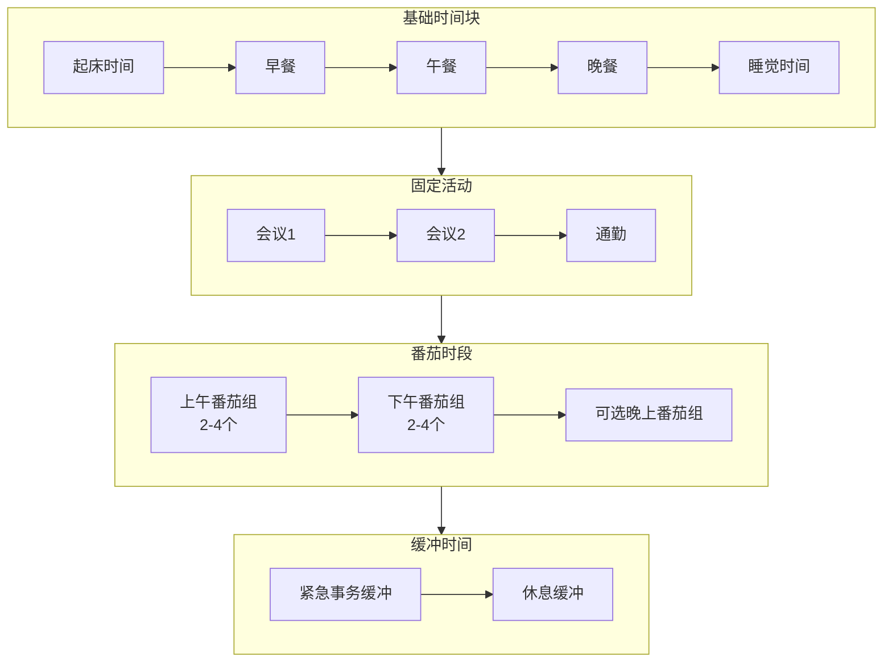

# 第五阶段：建立作息

**目标**：制定适合你的每日时间表。

---

## 为什么要制定时间表

有了番茄工作法的基础后，下一步是：
- **从任务驱动转向时间驱动**
- **主动设计一天，而非被动响应**
- **建立可预测的节奏**

---

## Pomotention 的 TimeTable 功能

**位置**：软件中的 TimeTable 视图

**用途**：
- 可视化展示一天的安排
- 以 30 分钟或 1 小时为区块
- 显示番茄时段、休息时段、固定活动（会议、午餐等）

### 创建你的时间表

1. **打开 TimeTable**
2. **标记固定时间块**
   - 起床、早餐、午餐、晚餐
   - 不可避免的会议或约会
3. **安排番茄时段**
   - 在剩余的空块中安排番茄
   - 考虑能量曲线（上午效率高就多安排）
4. **留出缓冲**
   - 不要排满，留出 20% 缓冲应对意外

---

## 时间表构建流程

---

## 时间表模板示例

### 标准工作日（9:00-18:00）

| 时间 | 活动 | 番茄数 |
|------|------|--------|
| 09:00-09:30 | 规划 + 第一个番茄启动 | 1 |
| 09:30-10:00 | 休息 | - |
| 10:00-12:00 | 深度工作（2轮，4个番茄）| 4 |
| 12:00-13:00 | 午餐 + 长休息 | - |
| 13:00-15:00 | 深度工作（2轮，4个番茄）| 4 |
| 15:00-15:30 | 休息 | - |
| 15:30-17:30 | 协作/会议/邮件（2轮，4个番茄）| 4 |
| 17:30-18:00 | 整理 + 规划明天 | - |

**总计**：13 个番茄（6.5 小时深度工作）

### 灵活工作日的变体

如果你无法集中大块时间：
- 拆分为 2 个番茄的小块
- 在会议间隙插入番茄
- 用 TimeTable 找到所有可用碎片

---

## 时间表的调整原则

### 不要追求完美

**时间表是工具，不是枷锁**：
- 完成 70% 就是成功
- 意外是常态，缓冲时间是必需的
- 每周根据实际调整

### 区分"必须"和"理想"

**必须完成**：
- 与他人的约定（会议、截止日期）
- 生理需求（吃饭、睡觉）

**理想安排**：
- 番茄时段可以移动
- 任务可以调整顺序
- 根据实际情况灵活

---

## 从 DayPlanner 到 TimeTable

### 日常流程

1. **前一天晚上**
   - 在 DayPlanner 选择次日任务
   - 预估番茄数
   - 在 TimeTable 中规划时段

2. **当天早上**
   - 查看 TimeTable 了解一天安排
   - 微调（如有必要）
   - 开始第一个番茄

3. **当天结束**
   - 对比 TimeTable 计划和实际执行
   - 在 StatisticView 查看完成率
   - 记录偏差原因

---

## 本阶段检查清单

- [ ] 使用 TimeTable 创建了个人每日时间表
- [ ] 标记了所有固定活动（会议、用餐等）
- [ ] 在剩余时段安排了合理的番茄数量
- [ ] 留出了 20% 的缓冲时间
- [ ] 每周根据实际执行调整时间表

---

## 完成五个阶段

当你完成以上五个阶段：
1. ✅ 记录时间 — 了解真实用时
2. ✅ 应对打断 — 保护专注
3. ✅ 预估任务 — 准确预测
4. ✅ 优化流程 — 建立节奏
5. ✅ 建立作息 — 制定时间表

你已经掌握了番茄工作法的核心。接下来了解 [06-three-lists.md](06-three-lists.md)，看看三张清单在 Pomotention 中如何数字化实现。
