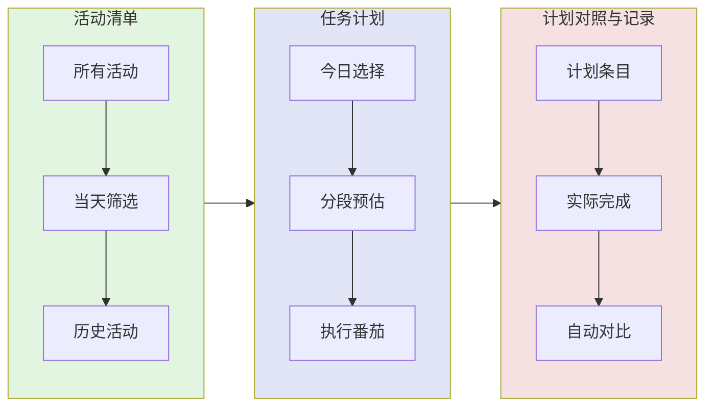

# 三张清单：数字化实现

番茄工作法的三张清单（活动清单、今日待办、当日记录）在 Pomotention 中以数字方式有机融合。

> 界面分区与字段名以 [软件界面](../reference/interface.md)、[活动清单](../reference/activity.md)、[任务计划](../reference/planner.md)、[任务追踪](../reference/task.md) 为准；清单与计划、追踪、时间表之间如何流动见 [模块联动](../reference/workflow.md)。

---

## 三张清单的传统定义

### 活动清单（Activity Inventory）

- **用途**：存放所有需要完成的任务
- **特点**：长期、不限制时间、可随时添加
- **格式**：任务名称 + 截止日期（如有）

### 今日待办（To Do Today）

- **用途**：从活动清单中选择今天要做的事
- **特点**：每天早上制定，当天执行
- **格式**：任务 + 预估番茄数

### 当日记录（Records）

- **用途**：记录当天实际完成情况
- **特点**：每天结束填写，用于复盘
- **格式**：实际番茄数、中断次数、备注

---

## Pomotention 的融合设计



### 为什么选择融合

**纸质时代的分离**：需要三张物理纸张，手动复制信息。

**数字时代的融合**：

- **活动清单**是总仓库（右侧面板）
- **任务计划**承载「今日待办」与计划侧视图（中间偏上），并与实际执行对照
- **任务追踪**与番茄记录补充「当日记录」的细节（中间偏下）
- 数据实时同步，无需手动复制

---

## 活动清单详解

### 核心功能

**位置**：首页**右侧面板**（见 [活动清单](../reference/activity.md)）

**用途**：

1. **长期任务池**：存放所有想做但未安排的活动
2. **当天筛选**：快速查看今天的活动
3. **历史归档**：已完成活动可按数据页等入口查阅

### 字段说明

- **标题 / 描述**：简洁描述要做什么
- **预估番茄数**：首次预估
- **标签**：分类与筛选（见 [标签系统](../reference/tag.md)）
- **截止日期**：可选

### 使用流程

```
想到活动 → 先放进活动清单 → 暂不排日
每天早上 → 从中选今日条目 → 纳入任务计划
活动完成 → 归档或改状态 → 在数据查看中检索历史
```

---

## 任务计划：今日待办与计划对照

### 核心功能

**位置**：首页中间偏上**任务计划区**（见 [任务计划](../reference/planner.md)）

**用途**：

1. **今日计划**：选择今天要执行的活动
2. **分段预估**：细化 1-3 段执行计划
3. **计划对照**：展示计划与执行进度（以界面为准）

### 字段说明

- **任务卡片**：从活动清单纳入的任务
- **分段预估**：最多 3 段（与 planner 文档「果果」等说明一致）
- **番茄计数**：已完成 / 预估等展示

### 数据同步

**与活动清单同步**：

- 修改任务计划中的预估 → 活动清单侧联动更新
- 活动清单中详情变化 → 任务计划实时反映

**与任务追踪联动**：

- 番茄完成、记录流程的结果会反映到任务计划与活动状态（见 [任务追踪](../reference/task.md)、[番茄时钟](../reference/timer.md)）

---

## 当日记录的查看方式

### 方式 1：任务计划实时查看

- 计划列与完成状态以日 / 周 / 月视图为准（见 [任务计划](../reference/planner.md)）

### 方式 2：任务追踪详细记录

- 每次番茄的完成状态、精力、打断等（见 [任务追踪](../reference/task.md)）

### 方式 3：数据页与列表统计

- 当日番茄数、完成率等（见 [软件界面](../reference/interface.md)、[数据查看](../reference/search.md)）

### 方式 4：数据趋势

- 历史趋势与预估准确度等（见 [数据趋势](../reference/chart.md)）

---

## 清单流转示例

### 场景：完成一篇报告

**第 1 步：活动清单（提前几天）**

```
活动：撰写季度报告
预估番茄数：待定
标签：工作/重要
状态：未排日
```

**第 2 步：纳入任务计划（当天早上）**

```
活动：撰写季度报告
分段预估：
  段 1：数据整理（1 番茄）
  段 2：撰写正文（3 番茄）
  段 3：修改润色（1 番茄）
状态：进行中
```

**第 3 步：执行与记录（当天）**

```
实际完成：
  数据整理：1 番茄 ✓
  撰写正文：4 番茄（比预估多 1 个）
  修改润色：0 番茄（推到明天）
记录：在任务追踪中标记各段完成情况
```

**第 4 步：次日回顾**

```
在任务计划中查看：
  - 计划 5 个番茄，实际 5 个番茄（分布不同）
  - 写作比预想复杂，下次预估要增加
  - 剩余修改仍在活动清单，下次继续
```

---

## 本章节总结

| 清单     | 传统纸质 | Pomotention 落点                 | 界面位置（见 interface） |
| -------- | -------- | -------------------------------- | ------------------------ |
| 活动清单 | 一张纸张 | 活动清单视图                     | 右侧                     |
| 今日待办 | 一张纸张 | 任务计划视图（计划侧）           | 中间偏上                 |
| 当日记录 | 一张纸张 | 任务计划对照 + 任务追踪 + 数据页 | 中间 / 数据页            |

**核心优势**：

- 无需手动复制数据
- 实时同步，自动对比
- 历史记录可检索与导出（见 [数据与迁移](../archive/data.md)）
- 多维度分析（搜索、图表、统计）

---

## 下一步

了解清单实现后，前往 [07-when-stuck.md](07-when-stuck.md) 学习遇到问题时的调整方法。
