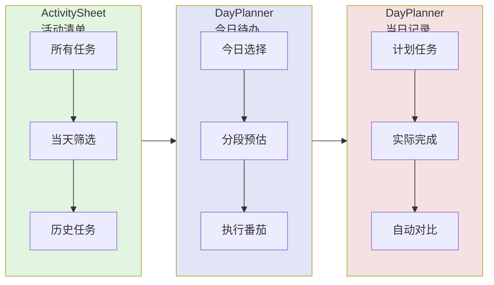

# 三张清单：数字化实现

番茄工作法的三张清单（活动清单、今日待办、当日记录）在 Pomotention 中以数字方式有机融合。

---

## 三张清单的传统定义

### 活动清单（Activity Inventory）
- **用途**：存放所有需要完成的任务
- **特点**：长期、不限制时间、可随时添加
- **格式**：任务名称 + 截止日期（如有）

### 今日待办（To Do Today）
- **用途**：从活动清单中选择今天要做的事
- **特点**：每天早上制定，当天执行
- **格式**：任务 + 预估番茄数

### 当日记录（Records）
- **用途**：记录当天实际完成情况
- **特点**：每天结束填写，用于复盘
- **格式**：实际番茄数、中断次数、备注

---

## Pomotention 的融合设计



### 为什么选择融合

**纸质时代的分离**：需要三张物理纸张，手动复制信息。

**数字时代的融合**：
- ActivitySheet 是任务的总仓库（活动清单）
- DayPlanner 是当天的执行视图（今日待办 + 当日记录）
- 数据实时同步，无需手动复制

---

## ActivitySheet：活动清单详解

### 核心功能

**位置**：软件左侧

**用途**：
1. **长期任务池**：存放所有想做但未安排的任务
2. **当天筛选**：快速查看今天的任务
3. **历史归档**：已完成的任务自动归档

### 字段说明

- **任务名称**：简洁描述要做什么
- **estPomo**：预估番茄数（首次预估）
- **标签**：用 TagSystem 分类
- **截止日期**：可选，用于紧急任务

### 使用流程

```
想到任务 → 添加到 ActivitySheet → 暂不安排
每天早上 → 从中选择今日任务 → 拖到 DayPlanner
任务完成 → 自动归档 → 可在 SearchView 查看历史
```

---

## DayPlanner：今日待办 + 当日记录

### 核心功能

**位置**：软件中间区域

**用途**：
1. **今日计划**：选择今天要执行的任务
2. **分段预估**：细化任务的 1-3 段执行计划
3. **实际记录**：自动对比计划 vs 实际

### 字段说明

- **任务卡片**：从 ActivitySheet 拖入的任务
- **estPomo 分段**：最多 3 段预估
  - 段 1：子任务 A（如"构思"）
  - 段 2：子任务 B（如"写作"）
  - 段 3：子任务 C（如"修改"）
- **番茄计数**：显示已完成/预估番茄数

### 数据同步

**与 ActivitySheet 同步**：
- 修改 DayPlanner 的预估 → ActivitySheet 自动更新
- ActivitySheet 的任务详情变化 → DayPlanner 实时反映

**与 TaskTracker 联动**：
- 点击 TaskButton 弹出记录窗口
- 番茄完成情况自动同步到 DayPlanner

---

## 当日记录的查看方式

### 方式 1：DayPlanner 实时查看

- 计划任务列显示"计划"
- 已完成任务显示"实际"
- 番茄图标显示完成进度

### 方式 2：TaskTracker 详细记录

- 点击 TaskButton 查看每次番茄的详细记录
- 包括：完成状态、精力水平、打断次数

### 方式 3：StatisticView 统计分析

- 当天完成番茄总数
- 预估 vs 实际对比
- 任务完成率

### 方式 4：ChartView 趋势图表

- 历史完成趋势
- 预估准确度变化
- 能量曲线分析

---

## 清单流转示例

### 场景：完成一篇报告

**第 1 步：活动清单（提前几天）**
```
任务：撰写季度报告
estPomo：待定
标签：工作/重要
状态：未安排
```

**第 2 步：拖到今日待办（当天早上）**
```
任务：撰写季度报告
estPomo：
  段 1：数据整理（1 番茄）
  段 2：撰写正文（3 番茄）
  段 3：修改润色（1 番茄）
状态：进行中
```

**第 3 步：执行与记录（当天）**
```
实际完成：
  数据整理：1 番茄 ✓
  撰写正文：4 番茄（比预估多 1 个）
  修改润色：0 番茄（推到明天）
记录：在 TaskTracker 中标记每段完成情况
```

**第 4 步：次日回顾（次日早上）**
```
查看 DayPlanner：
  - 计划 5 个番茄，实际 5 个番茄（虽然分布不同）
  - 写作比预想复杂，下次预估要增加
  - 剩余修改任务仍在 ActivitySheet，下次继续
```

---

## 本章节总结

| 清单 | 传统纸质 | Pomotention 实现 | 位置 |
|------|----------|------------------|------|
| 活动清单 | 一张纸张 | ActivitySheet | 左侧 |
| 今日待办 | 一张纸张 | DayPlanner（上半部分）| 中间 |
| 当日记录 | 一张纸张 | DayPlanner（下半部分）+ StatisticView | 中间/统计页 |

**核心优势**：
- 无需手动复制数据
- 实时同步，自动对比
- 历史记录永久保存
- 多维度分析（搜索、图表、统计）

---

## 下一步

了解清单实现后，前往 [07-when-stuck.md](07-when-stuck.md) 学习遇到问题时的调整方法。
