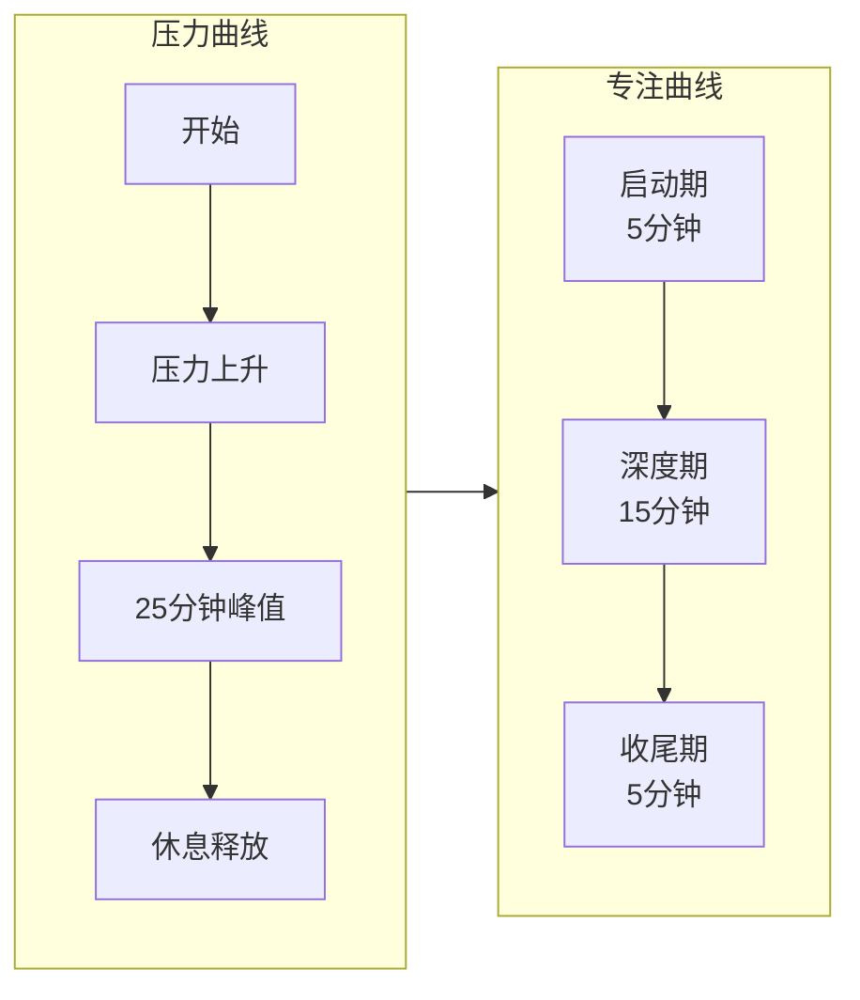

# 为什么有效

理解原理，才能灵活运用。

---

## 核心原理：时间的生成性

弗朗西斯科·西里洛在书中提出一个关键概念：

> **时间不是一条河，而是可以被生成的。**

### 传统时间观（具体连续性）
- 时间像河流一样流逝
- 我们无法控制时间
- "时间不够"是常态

### 番茄时间观（生成性）
- 每个番茄是一个"时间容器"
- 我们主动生成时间块
- "我创造了 8 个番茄的时间"是可控的

### 实际意义

**当你说"我没有时间"**：
- 传统视角：被动接受时间匮乏
- 番茄视角：主动选择不生成这个时间

**当你完成一个番茄**：
- 你生成了 25 分钟的专注时间
- 这是你的成就，不是时间的施舍

---

## 为什么 25 分钟有效



### 25 分钟的科学依据

1. **启动成本**：进入专注状态需要 5-10 分钟
2. **深度窗口**：大多数人能保持深度专注 15-20 分钟
3. **压力边界**：25 分钟是大多数人能承受的"延迟满足"极限
4. **休息重置**：5 分钟足够恢复，又不至于完全打断心流

### 为什么不是更长？

- **45-60 分钟**：多数人 30 分钟后效率下降
- **90 分钟**：太长，难以开始；被打断损失大
- **25 分钟**：刚好进入状态，又刚好不会疲惫

---

## 为什么记录改变行为

### 观察效应

**当你知道自己在记录**：
- 行为会自然改善
- 打断变得"可见"
- 预估偏差变得"可量化"

### 数据反馈

**Pomotention 提供的数据**：
- 完成番茄数 → 成就感
- 预估准确度 → 掌控感
- 打断次数趋势 → 进步感

**没有数据**：
- "我感觉今天效率不高"（模糊焦虑）
- "我好像总是被打断"（无法验证）

**有数据**：
- "今天完成了 6 个番茄，比昨天多 2 个"（具体进步）
- "打断次数从 5 次降到 2 次"（可验证改善）

---

## 为什么休息同样重要

### 认知资源是有限的

**大脑像肌肉**：
- 持续使用会疲劳
- 需要休息恢复
- 过度使用会受伤（倦怠）

### 番茄的节奏设计

```
工作 → 休息 → 工作 → 休息 → 长休息
 25    5     25    5      15-30
```

**短休息（5分钟）**：
- 让大脑切换模式
- 防止疲劳累积
- 保持全天可持续

**长休息（15-30分钟）**：
- 深度恢复
- 处理长时记忆
- 防止下午崩溃

### 不休息的代价

**连续工作 2 小时**：
- 第 1 小时：效率 100%
- 第 2 小时：效率 60%
- 总计：160 单位产出

**番茄节奏（2 小时 = 4 番茄 + 3 休息）**：
- 每个番茄：效率 90%
- 总计：180 单位产出

**休息不是浪费时间，是投资效率。**

---

## 为什么预估训练认知

### 元认知能力

预估训练的是：
- **对自己能力的认知**（我能多快完成？）
- **对任务复杂度的认知**（这有多难？）
- **对环境干扰的认知**（会有多少打断？）

### 预估不准的价值

**不是要你猜对，而是要你思考**：
- 为什么我猜 2 个番茄实际用了 4 个？
- 我忽略了什么因素？
- 下次如何改进？

**这种反思本身就是学习。**

---

## 为什么番茄工作法可持续

### 与其他方法的对比

| 方法 | 问题 | 番茄工作法的解决 |
|------|------|-----------------|
|  todo list | 永远做不完，焦虑 | 限制每天任务数 |
|  时间块规划 | 太 rigid，难以坚持 | 25 分钟易于开始 |
|  意志力 | 有限，会耗尽 | 形成习惯，减少消耗 |
|  完美主义 | 拖延启动 | "只做 25 分钟"降低门槛 |

### 可持续性来源

1. **低启动成本**
   - 25 分钟比"完成整个项目"容易开始
   - 完成一个就有成就感

2. **即时反馈**
   - 每个番茄结束都有明确标记
   - Pomotention 的数据可视化强化成就感

3. **灵活适应**
   - 可以调整时长
   - 可以调整任务量
   - 不需要完美执行

4. **习惯形成**
   - 重复 66 天后成为自动行为
   - 不再需要意志力
   - 变成"默认工作方式"

---

## 数字化 vs 纸质

### 纸质的优势
- 触感，书写体验
- 无干扰（没有通知）
- 简单，无学习成本

### Pomotention 的优势
- **自动统计**：无需手动计算
- **历史查询**：永久保存，随时回顾
- **可视化**：ChartView 趋势图
- **搜索**：快速找到历史任务
- **同步**：多设备访问
- **书写模板**：内置 CBT 写作辅助

### 选择建议

**用纸质**：
- 喜欢书写的感觉
- 不想看屏幕
- 简单任务管理

**用 Pomotention**：
- 需要数据分析
- 任务复杂，需要搜索和归档
- 想要可视化趋势
- 需要书写模板辅助

**也可以结合**：
- 白天用 Pomotention 记录
- 晚上用纸笔复盘
- 周末用纸笔做周计划

---

## 总结：番茄工作法的核心

1. **生成时间**：不是被动接受时间，而是主动创造时间块
2. **保护专注**：25 分钟的保护罩，减少打断影响
3. **建立节奏**：工作与休息交替，可持续全天
4. **训练预估**：通过对比预估vs实际，提升自我认知
5. **记录反馈**：数据让进步可见，焦虑减少

---

## 开始你的番茄之旅

现在你已经理解了原理，回到 [00-start-here.md](00-start-here.md)，开始实践。

记住：**完成比完美重要，持续比爆发重要。**

祝你的每个番茄都充实而专注。
