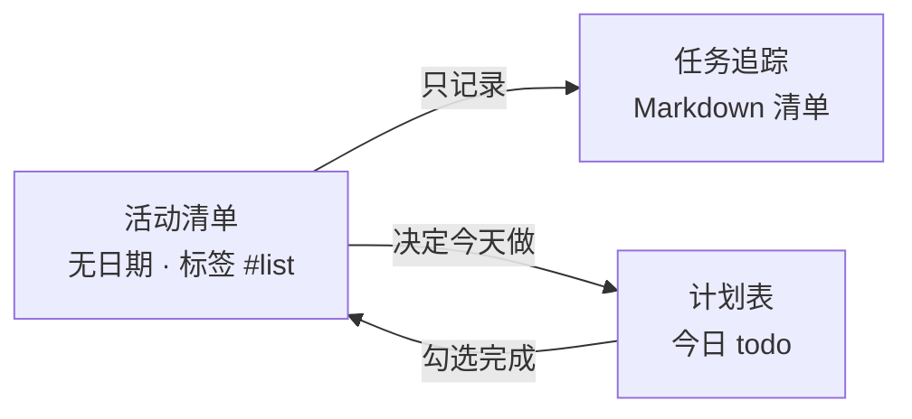

# 长期事项与待办库存

::: tip 适合谁读

- 周期 **长**、路径 **不熟**、目标 **可能调整** 的事（产品开发、学习一门新领域、个人 side project 等）
- 已会用 [活动清单](../reference/activity.md)、[计划表](../reference/planner.md)、[任务追踪](../reference/task.md)，想少被「今日待办」绑架，又不想让想法消失

模块关系见 [模块联动](../reference/workflow.md)；三张清单语境见 [三张清单：数字化实现](../pomodoro-technique/06-three-lists.md)。

:::

## 快速导航

- 这和传统 PM 有何不同：见 [轻量 backlog 是什么](#轻量-backlog-是什么)
- 推荐日常结构：见 [推荐结构一条无日期活动--任务清单](#推荐结构一条无日期活动--任务清单)
- 今天做还是以后做：见 [now-与-later-前缀](#now-与-later-前缀)
- 清单太长怎么办：见 [清单变长何时整理何时新开活动](#清单变长何时整理何时新开活动)
- 何时用子活动：见 [何时拆成子活动](#何时拆成子活动)
- 和冲刺 / 专注的关系：见 [和固定周期冲刺配合](#和固定周期冲刺配合)
- 以后可能的产品方向：见 [以后可能的产品方向](#以后可能的产品方向)

## 轻量 backlog 是什么

Pomotention **没有**单独的「Backlog」模块。下面做法用的是已有分层：

| 层级                              | 在本模式里的角色                                                          |
| --------------------------------- | ------------------------------------------------------------------------- |
| **活动 `activity`（无执行日期）** | **库存 / 收件箱**：事情还 **没承诺** 哪一天做                             |
| **计划表 `todo`（有日期）**       | **承诺**：今天（或某天）真的要做的几件事                                  |
| **任务 `task`（Markdown）**       | **一条活动的生命周期笔记本**：过程、分步、`- [ ]` / `- [x]`、能量与打扰等 |
| **标签 `#`**                      | 区分主题、阶段，或在 [数据查看](../reference/search.md) 里筛选            |

目标不是把 Pomotention 变成 Jira，而是：**想法有处可放；只有下决心做的才进计划表；执行与复盘留在 Task。**



## 推荐结构：一条无日期活动 + 任务清单

### 1. 建一条「库存」活动

- 放在 [活动清单](../reference/activity.md)，**不要**点「加入日期」（保持无 `dueDate`）。
- 标题示例：`产品待办 · list`、`Timer 14d`。
- 用 [标签](../reference/tag.md) 标记主题，例如 `#list`、`#backlog`、`#timer-now`（见下节）。

### 2. 在对应 Task 里维护 `- [ ]`

从该活动进入 [任务追踪](../reference/task.md)，在任务描述里用 Markdown 清单：

```markdown
## 收件箱（未做）

- [ ] [later] Mac 安装包签名
- [ ] [now] Win Timer 独立构建可安装

---

## 2026-05 已完成

- [x] [now] 修复换天显示 bug
```

**为何放在 Task 而不是只靠活动标题？**

- 符合「**Task 管一条事的整个生命周期**」：从模糊想法到勾掉、附笔记。
- 活动标题保持短；长列表在 Task 里滚动即可。
- Task 内 checkbox 可点击勾选（见任务追踪书写区）。

**不必**为了 backlog 把每条都拆成活动 **子活动**；子活动留给「以后要进计划表、要估 🍅」的条目（见 [何时拆成子活动](#何时拆成子活动)）。

## `[now]` 与 `[later]` 前缀

在 `- [ ]` 文案前加前缀（自定即可，团队统一更重要）：

| 前缀      | 含义                                              |
| --------- | ------------------------------------------------- |
| `[now]`   | 当前阶段 **允许做**；可再 **加入今天** 的计划表   |
| `[later]` | **只记录**，本阶段默认不做（换 sprint、有空再做） |

**每日规则（防 scope 漂移）**

1. 计划表 **今天** 只从 `[now]` 里挑 **1～3 条** 变成 `todo`。
2. Activity 里只有 `[later]`、且 **没进今天** 的 → 默认今天 **不打开**。
3. 主项目 **现网 blocker**（例如数据错误）可当天进 `todo`，算例外，不必先改成 `[now]`。

标签可与前缀并用：例如活动打 `#list`，冲刺项在 Task 里写 `[now]`，或额外打 `#timer-now` 便于 [数据查看](../reference/search.md) 筛选。

## 清单变长：何时整理、何时新开活动

### 先在同一条 Task 里整理（默认）

**不必新建活动** 若：

- 未勾条目仍 **一眼能扫完**（例如收件箱里少于约 15 条 `[ ]`）；
- 主题仍是一类事（都是同一产品待办）。

做法：把已勾掉的 `[x]` **剪到** 文末 `## 已完成（年月）` 小节，收件箱只留未做。

### 新开一条活动（封存 + 新收件箱）

**满足任一** 即可新开，**旧条保留不删**（当档案）：

| 信号                                                  | 做法                                                                                               |
| ----------------------------------------------------- | -------------------------------------------------------------------------------------------------- |
| 未勾条目太多，**30 秒内找不到** 下一件 `[now]`        | 新建 `list · inbox 2026-05`；旧条标题改 `list · archive 至 2026-05`，Task 首行注明「新想法去 xxx」 |
| **新阶段 / 新主题**（如开始「Timer 独立安装包」冲刺） | 新建 `Timer 14d` 活动；泛泛 `#list` 不再塞 sprint 项                                               |
| 一屏里 **`[x]` 远多于 `[ ]`**，心理上不想再往同页写   | Task 内归档不够时，复制活动 → 新活动清空收件箱                                                     |
| **固定周期结束**（如 14 天冲刺）                      | 封存该 sprint 活动；日常回到 `list` 或下一轮收件箱                                                 |

**简单规则**

> 还能快速找到下一件 `[now]` → 不新建。  
> 找不到，或主题换了 → 新建，旧的改名 archive。

## 何时拆成子活动

| 继续放在 Task 的 `- [ ]`     | 拆成活动 **子活动**（或单独一条 activity） |
| ---------------------------- | ------------------------------------------ |
| 笔记、链接、模糊想法         | 已决定是 **独立一事**                      |
| 短期不进计划表               | 需要 **估番茄、加入某天计划表**            |
| 在同一段 Markdown 里排序即可 | 要在活动清单里 **拖动排序**、单独打标签    |

子活动仍可无日期；「承诺今天做」时再 **加入日期** → 计划表 `todo` → 做完在计划表 **勾选**，活动侧按 [模块联动](../reference/workflow.md) 隐藏。

## 和固定周期冲刺配合

独立开发者 **短周期冲刺**（例如 14 天只交付 Windows Timer 安装包）可叠加本模式：

1. **一条 sprint 活动**（无日期），如 `Timer 14d`；Task 里列 `[now]` / `[later]`。
2. **泛泛 `#list`** 继续收长期想法，不把 sprint 和百年待办混在同一页。
3. 冲刺结束：**封存** sprint 活动；`[later]` 留在 list 或下一轮收件箱。
4. 更完整的 **目标 / 不做清单 / 第 7 天砍 scope** 可写在仓库 `docs/dev-log/`（活跃关 `current.md`，长备忘 `blueprint/`），与软件内 backlog 互补。

## 以后可能的产品方向

::: warning 非当前操作前提

以下为 **产品构想归档**，**不是** 现在必须会的功能。当前请用本文的 **标签 + 无日期活动 + Task 清单** 即可。

:::

| 方向                              | 现状（文档编写时）                                            | 说明                                                                        |
| --------------------------------- | ------------------------------------------------------------- | --------------------------------------------------------------------------- |
| **`activity.projectId` 项目字段** | 数据模型已有 `projectId`，界面与筛选未作为一等公民            | 未来或用于按「项目」聚合活动；现阶段用 **标签 + 一条库存活动标题** 代替     |
| **数据查看页「文件夹 / 项目树」** | [数据查看](../reference/search.md) 以搜索、标签 AND、星标为主 | 未来或支持按项目/文件夹浏览；现阶段用 **标签筛选 + 多条 archive 活动** 代替 |

若实现上述能力，会在 [更新日志](../../dev-log/history/CHANGELOG.md) 与 [开发地图](../intro/roadmap.md) 中说明；更长构想只在仓库工程笔记里（不进帮助站）。本文操作步骤 **仍以当前版本为准**。

## 限制与说明

- 无日期的活动 **总会** 显示在今日到期 ；库存靠 **标签、归档小节、新开活动** 维护。
- Task 内清单 **不会** 自动同步到计划表；`[now]` 项要 **手动加入今天** 才算承诺。
- 本模式 **不替代** 番茄钟计时与当日时间表；专注执行仍用 [番茄时钟](../reference/timer.md) 与 [时间表](../reference/timetable.md)。
