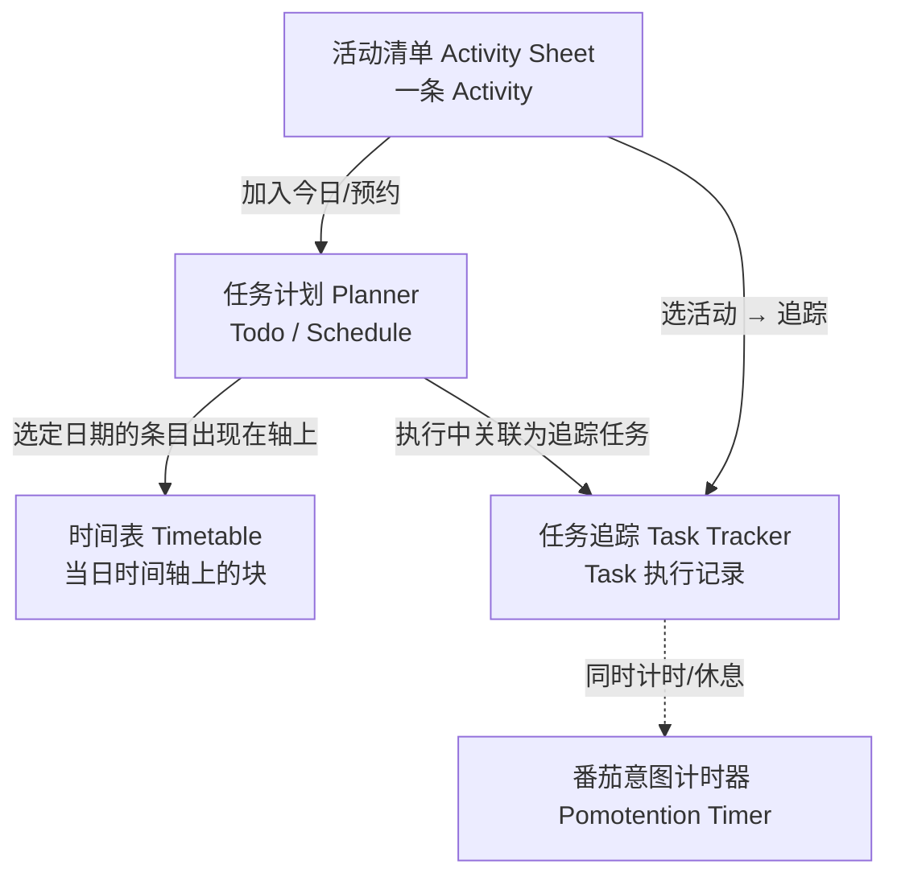
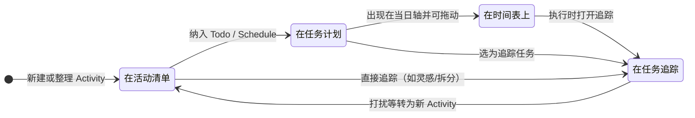

# 软件界面说明

::: tip 快速查阅

- [附录：按钮速查表](../appendix/buttons.md)
- [附录：术语对照表](../appendix/glossary.md)
  :::

## 1 顶栏（Menu）

### 1.1 路由菜单

**核心功能**：

- 切换到`首页`
- 切换到`数据页`，查看全部活动，[详见](search.md)
- 切换到`仪表盘`，查看行为数据趋势, [详见](./chart.md)
- 切换到`帮助页`，查看软件帮助信息
- 切换到`设置页`，软件状态及调试工具
- 
  手机端收缩菜单按钮

### 1.2 布局切换

|                                                                                按钮图标                                                                                 | 功能说明                               |
| :---------------------------------------------------------------------------------------------------------------------------------------------------------------------: | :------------------------------------- |
|        | 切换时间表视图 `Timetable`             |
|        | 切换任务计划视图 `Planner`             |
|  | 切换任务追踪视图 `Task Tracker`        |
|      | 切换活动清单视图 `Activity Sheet`      |
|           | 切换番茄意图计时器 `Pomotention Timer` |
|             | 切换计时器置顶模式（仅桌面应用）       |
|                                                                                                                                                                         |

### 1.3 账号与数据

已登录时顶栏「退出」触发器上的图标含义（`CloudSync20Regular` / `Person20Regular`）：

- **云同步图标**：正在与云端同步（上传/下载进行中）。
- **人物图标 + 蓝色（info）**：当前无同步进行中，但本地有尚未上传的变更。
- **人物图标 + 琥珀色（warning）**：最近一次同步里**云端下载未成功**；可能仍显示具体错误文案；可稍后重试同步或使用底栏/设置中的上传下载。
- **人物图标 + 默认色**：无上述状态。

同步失败时可能弹出简短通知（尤其移动端无底栏错误区时）。

- 详见：[账号与数据](../intro/account-and-data.md)

## 2 左侧面板：时间表 / 区块编辑器（Timetable / Block editor）

**核心功能**：

- 可视化一日的工作、休息分布
- 编辑工作/休闲时间表，切换显示
- 在可用时间区间内互动式安排任务
- 详见：[时间表构建](timetable.md)

## 3 中央上面板：任务计划（Planner）

**核心功能**：

- 规划管理待办 `to-dos` 、预约 `schedules`和活动 `activities`
- 显示任务追踪信息 `task`
- 日、周、月、年视图切换及导航
- 展示当前视图日期信息
- 展示累积番茄量
- 基于标签筛视图中的活动
- 滚动展示当前核心意图
- 详见：[任务计划](planner.md)

## 4 中央下面板：任务追踪（Task Tracker）

**核心功能**：

- 展示标签 `tag` 和任务状态信息
- 记录精力消耗 `energy` ，奖赏值 `reward` 情况
- 标记任务被打断情况（内部/外部打扰）`activities` 并转化为活动
- 保存和提取书写模板 `writing template`
- 详见：[任务追踪](task.md)

## 5 右侧面板：活动清单（Activity Sheet）

**核心功能**：

- 增删改活动 `activities`
- 利用筛选和拖拽功能构建看板
- 将活动加入任务计划
- 以颜色标记活动的时效和状态
- 详见：[活动清单](planner.md)

## 6 浮动区域：番茄意图计时器（Pomotention Timer）

**核心功能**：

- 单次工作或休息计时
- 连续工作或休息计时
- 自定义工作、休息时长
- 自定义工作白噪音
- 自定义工作标语
- 计时器置顶（仅桌面应用）
- 详见：[番茄意图计时器](timer.md)

## 7 功能联动说明

可以把首页想成一条流水线：**活动清单**负责「有什么」；**任务计划**负责「哪天做、排进日历语义」；**时间表**负责「这一天里几点到几点」；**任务追踪**负责「真正做的时候写了什么、耗了多少精力」；**番茄钟**负责「当下这一段是否在计时」。下面两张图分别对应「区域之间往哪送数据」和「同一条工作从想法到记录」的大致顺序；拖动、筛选等多是**在同一区域里改形状**，跨区时才会出现箭头上的那些动作。

### 7.1 区域之间：数据往哪流

- 上图里 **`Activity`** 始终在清单侧；进入计划后仍是同一条数据在 **`Planner`** 里换视图展示。
- **`Task`** 在追踪侧：可以从清单或计划「点进追踪」挂上，执行中的文字、能量、打断等多写在这里。
- **`Timetable`** 上的拖动改的是**当天时间分配**（可视化一日），不替代 `Planner` 里周/月视角的排程语义。
- **`Pomotention Timer`** 不「存业务数据」，但与追踪同时进行时，构成执行情境（预估时长、实际专注段等）。

### 7.2 同一件事：从条目到记录（生命周期直觉）

### 7.3 联动要点（对照上图）

1. **`Activity Sheet` → `Planner`**：把选定活动加入计划，成为待办 `Todo` 或预约 `Schedule`。
2. **`Activity Sheet` → `Task Tracker`**：不先排程也可以追踪——适合灵感、拆分、边做边记。
3. **`Planner` → `Task Tracker`**：执行某条已排活动时，在追踪区写状态、想法、能量等，对应 **`Task`**。
4. **`Planner` → `Timetable`**：当前选定日期的 `Todo` / `Schedule` 会出现在左侧时间轴；**拖动块**是在把「这一天里」的占位调到具体时段。
5. **`Planner` 内**：日 / 周 / 月 / 年视图切换，用来从不同时间尺度看趋势（仍在计划语义内，与时间表「单日轴」互补）。
6. **`Pomotention Timer`**：与 `Todo` 的预估、执行中的专注段配合，提供计时情境；可与追踪并行使用。

术语若混用，见 [附录：术语对照表](../appendix/glossary.md)。
