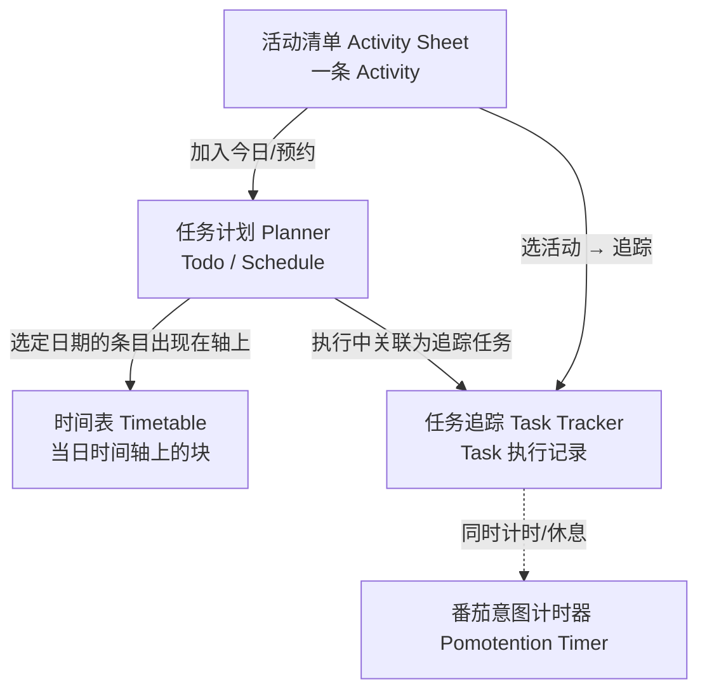
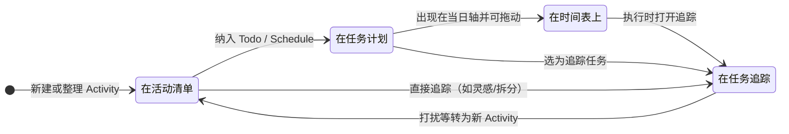

# 首页区域联动

可以把首页想成一条流水线：**活动清单**负责「有什么」；**任务计划**负责「哪天做、排进日历语义」；**时间表**负责「这一天里几点到几点」；**任务追踪**负责「真正做的时候写了什么、耗了多少精力」；**番茄钟**负责「当下这一段是否在计时」。下面两张图分别对应「区域之间往哪送数据」和「同一条工作从想法到记录」的大致顺序；拖动、筛选等多是**在同一区域里改形状**，跨区时才会出现箭头上的那些动作。

分区与顶栏入口见 [软件界面](./interface.md)。

## 1 区域之间：数据往哪流

- 上图里 **`Activity`** 始终在清单侧；进入计划后仍是同一条数据在 **`Planner`** 里换视图展示。
- **`Task`** 在追踪侧：可以从清单或计划「点进追踪」挂上，执行中的文字、能量、打断等多写在这里。
- **`Timetable`** 上的拖动改的是**当天时间分配**（可视化一日），不替代 `Planner` 里周/月视角的排程语义。
- **`Pomotention Timer`** 不「存业务数据」，但与追踪同时进行时，构成执行情境（预估时长、实际专注段等）。

## 2 同一件事：从条目到记录（生命周期直觉）

## 3 联动要点（对照上图）

1. **`Activity Sheet` → `Planner`**：把选定活动加入计划，成为待办 `Todo` 或预约 `Schedule`。
2. **`Activity Sheet` → `Task Tracker`**：不先排程也可以追踪——适合灵感、拆分、边做边记。
3. **`Planner` → `Task Tracker`**：执行某条已排活动时，在追踪区写状态、想法、能量等，对应 **`Task`**。
4. **`Planner` → `Timetable`**：当前选定日期的 `Todo` / `Schedule` 会出现在左侧时间轴；**拖动块**是在把「这一天里」的占位调到具体时段。
5. **`Planner` 内**：日 / 周 / 月 / 年视图切换，用来从不同时间尺度看趋势（仍在计划语义内，与时间表「单日轴」互补）。
6. **`Pomotention Timer`**：与 `Todo` 的预估、执行中的专注段配合，提供计时情境；可与追踪并行使用。

术语若混用，见 [附录：术语对照表](../appendix/glossary.md)。
