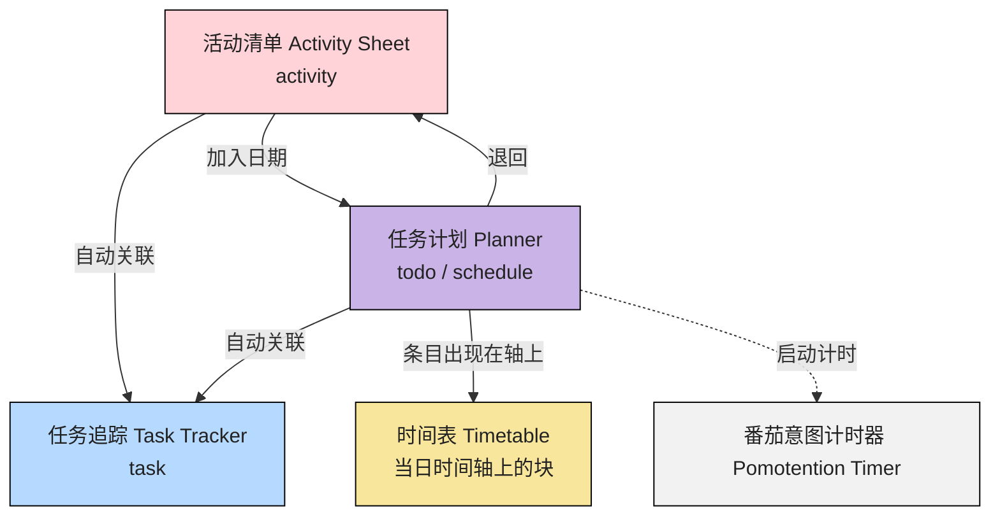

# 模块联动

::: tip
- 模块分区与顶栏入口见 [软件界面](./interface.md)
- 术语见 [附录：术语对照表](../appendix/glossary.md)
:::

## 快速导航

- 我想先看全局数据流：见 [区域之间的数据流](#区域之间的数据流)
- 我想按一条任务理解联动：见 [典型路径](#典型路径)
- 我想看跨模块规则：见 [联动规则](#联动规则)

## 模块分工

- `活动清单`：管理“有哪些事项”，负责收集、拆分与整理。
- `任务计划`：管理“哪天执行”，负责日/周/月时间语义。
- `时间表`：管理“当天何时做”，负责 24h 时间轴占位。
- `任务追踪`：管理“执行时发生了什么”，负责过程记录与反思。
- `番茄时钟`：管理“专注与休息节奏”，负责计时情境支持。

## 区域之间的数据流

- 同一条 `activity` 进入 `任务计划` 后，仍是同一条业务对象，不是复制品。
- `task` 属于追踪层，通常由 `活动清单` 或 `任务计划` 发起执行时产生并持续补充记录。
- `时间表` 拖拽只影响“当天时段占位”，不替代 `任务计划` 的周/月排程语义。
- `番茄时钟` 不承担核心业务存储，主要提供执行中的时间锚点。

## 典型路径

1. 在 `活动清单` 记录事项，形成 `activity`。
2. 将事项纳入 `任务计划`，形成 `todo` 或 `schedule`。
3. 在 `时间表` 为当天安排具体时段。
4. 在 `任务追踪` 记录执行过程、状态与打断。
5. 执行中出现的新想法可回写为新 `activity`，进入下一轮。

## 联动规则

1. `活动清单 → 任务计划`：把事项放入具体日期。
2. `活动清单/任务计划 → 任务追踪`：进入执行时创建并补充追踪记录。
3. `任务计划 → 时间表`：已排事项进入当天轴，再做时段级调整。
4. `任务计划` 支持日/周/月/年切换，和 `时间表` 的单日轴互补。
5. `番茄时钟` 可与追踪并行，增强执行过程的节奏感。
