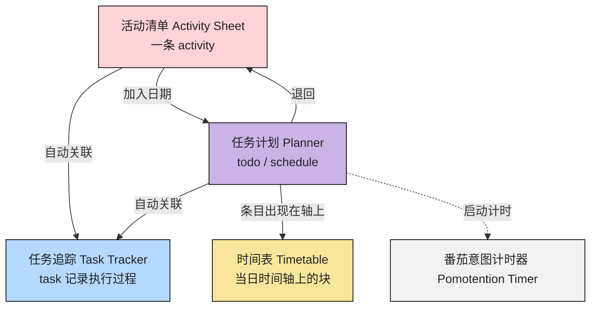

# 模块联动

::: tip

- 模块分区与顶栏入口见 [软件界面](./interface.md)
- 术语见 [附录：术语对照表](../appendix/glossary.md)
  :::

- 把应用想成由5个模块组成的条流水线：
  - **活动清单** 负责「有什么」；
  - **任务计划** 负责「哪天做、排进日历语义」；
  - **时间表** 负责「如何在有限时间（24 h）排布任务」；
  - **任务追踪** 负责「任务从一个想法到执行完成，真正发生了什么」；
  - **番茄计时器** 负责「用确定的时间段锚定注意力，保持工作和休息的节奏」。
- 下图对应「模块之间往哪送数据」；下面再用一段典型路径解释同一条工作如何走完一圈。

## 1 区域之间：数据往哪流

- 上图中的 **「活动」**（activity）始终保留在活动清单板块；当纳入任务计划后，实际上仍是同一条数据，只是在 **「计划」**（Planner）中以不同视图呈现。
- **「任务」**（Task）属于任务追踪模块：可以直接从活动清单或任务计划中「进入追踪」，并在执行过程中记录文本、精力变化、打断等相关信息。
- 在 **「时间表」**（Timetable）内拖拽任务，只影响当天时间的具体分配（可视化当天），**不会取代**「计划」模块中周/月视角的排程语义。
- **「番茄意图计时器」**（Pomotention Timer）本身不保存具体业务数据，但可与任务追踪同时启用，搭建实际执行场景（如用来记录预估时长、实际专注区段等）。

## 2 典型路径（从想法到记录）

- **起点（活动清单）**：先记下一条 `activity`，只回答「要做什么」。
- **纳入计划（任务计划）**：把该 `activity` 加入某一天，成为 `todo` 或 `schedule`。
- **落到当天（时间表）**：在当天时间轴拖动块，确定具体时段；这一步只影响当天排布。
- **开始执行（任务追踪）**：进入追踪后形成 `task`，记录进展、状态、能量与打断。
- **出现新事项（回写活动）**：执行中冒出的新想法或打断，可回写成新的 `activity`，进入下一轮。

## 3 联动要点

1. **`活动清单` → `任务追踪`**：生产一个活动 `activity`，并自动生成相关的任务 `task`，全生命周期追踪——适合灵感、拆分、边做边记。
2. **`活动清单` → `任务计划`**：把选定活动 `activity` 加入计划，成为待办 `todo` 或预约 `schedule`。
3. **`任务计划` → `时间表`**：当前选定日期的 `todo` / `schedule` 会出现在左侧时间轴；**拖动块**是在把「这一天里」的占位调到具体时段。
4. **`任务计划` → `任务追踪`**：执行某条已排活动时，在追踪区写状态、想法、能量等。
5. **`任务计划` 内**：日 / 周 / 月 / 年视图切换，用来从不同时间尺度看趋势（仍在计划语义内，与时间表「单日轴」互补）。
6. **`番茄意图计时器`**：与 `todo` 的预估、执行中的专注段配合，提供计时情境，可与追踪并行使用。
