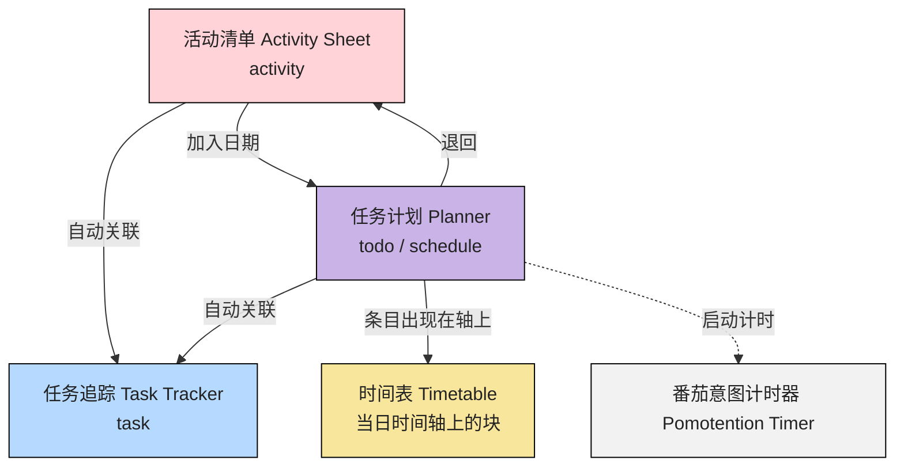

# 模块联动

::: tip

- 模块分区与顶栏入口见 [软件界面](./interface.md)
- 术语见 [附录：术语对照表](../appendix/glossary.md)
  :::

## 快速导航

- 我想先看全局数据流：见 [区域之间的数据流](#区域之间的数据流)
- 我想从生命周期区分 activity / todo / schedule / task：见 [行动的生命周期](#行动的生命周期)
- 我想从活动开始理解联动：见 [从活动清单开始](#从活动清单开始)
- 我想从任务开始理解联动：见 [从任务计划开始](#从任务计划开始)

## 区域之间的数据流

## 行动的生命周期

一条事项从「想到」到「做完留痕」，会依次落在不同**问题域**里；活动清单里的 `activity`、任务计划里的 `todo` / `schedule`、任务追踪里的 `task` ，是为了让每一层只回答一类问题，避免把「库存、日历承诺、时钟占位、执行档案、专注回合」混在同一张表里。

> 过去心不可得，现在心不可得，未来心不可得。 《金刚经》

1. **`activity`（活动清单）**  
   回答：**仓库里有什么？**  
   事项仍处在收集、拆解、打标签、估番茄的阶段，**尚未承诺**落在任务计划的哪一天；与具体执行日的绑定是可选的、可撤销的。

2. **`todo` / `schedule`（任务计划）**  
   回答：**我承诺在哪一天（及何种粒度上）处理它？**  
   二者都来自活动清单中的条目，`schedule` 是与他人之间约定的事件，有跟多的“他律”，而 `todo` 可能有截止日期却其实并没有一个具体的人在事件中，更需要“自律”。

3. **`task`（任务追踪）**  
   回答：**这一轮实际执行里发生了什么？**  
   从PDCA，发散的想法，到执行总结；相关的信息；
   能量、愉悦、打扰、书写模板等**过程数据**挂在追踪任务上；任何

4. **时间表与番茄时钟**  
   当执行时，以休息和工作组成的具体的时间块，如何在有限的24小时中分布，每个25分钟又是如何从想要做变为围绕具体的目的展开行动
   时间表回答：**今天 24 小时轴上，块落在哪一段？**  
    番茄时钟回答：**当前这一专注/休息回合的目标与节奏是什么？**  
    利用标度时间经验来保护时间之流的经验
   去理性的看到有限，去在辅助中校准感受

#### `todo` 与 `schedule` 的区别（是否有「对外时刻」）

与 [活动类型](./activity.md#活动类型) 的表述一致，可作如下把握（**不**把「是否与人开会」当成唯一判据，见下条「例外」）：

- **`todo`（待办）**  
  强调**自主安排、用番茄块消化**的工作：先落到「某一天」与分段预估，**不要求**在日历上钉死「从几点几分开始、持续多久」的对外时刻；适合写作、开发、整理等可由自己在当天内调整顺序的任务。

- **`schedule`（预约）**  
  强调**与外部时间轴对齐**的条目：在数据上带有**开始时间戳 + 持续时长**（可与地点等一并理解），典型是**与他人、他方约定**的会议、课、到场面谈等——即口语里「和人约了」的那一类。  
  计划里同一行类型沿用 `Schedule`，便于在时间轴、导出与提醒语义上按「硬时段」处理。

- **例外（仍走 `schedule` 语义，但不等于「和人约了」）**  
  **无所事事**等在清单里单独成类，在计划侧仍按「时段占位」建模（与未来的自己约定留白），用于防止空白被无意识填满；区分方式以界面与 [活动类型](./activity.md) 为准，而不是单凭「有没有别人」。

#### 「计划」与「意图」在本文中的用法

为避免与日常口语混用，在**模块联动**语境下建议这样读（与产品名中的 _Intention_ 及 [什么是 Pomotention？](../intro/what-is-pomotention.md) 对齐）：

- **计划（plan）**  
  指**任务计划 + 时间表**所表达的安排：把活动放进具体日期、再在当日轴上挪动时段。回答的是 **when（何时排进日程 / 轴上占位）**。

- **意图（intention）**  
  在心理学语境指 **执行意图**（Implementation Intention）：把「打算做」写成易于触发行动的条件结构；在本应用中落实为 **番茄意图**——**当前番茄（或休息）这一轮要瞄准什么**，可与计划中的条目绑定，也可以先计时再补计划。回答的是 **what / how to start（这一轮要达成什么、如何降低启动阻力）**。

简记：**计划**管日程与资源占位；**意图**管当下这一拍的启动与目标。二者衔接（从计划开钟）但不等价。

### 模块分工

- `活动清单`：管理“有哪些事项”，负责收集、拆分与整理。
- `任务计划`：管理“哪天执行”，负责日/周/月时间语义。
- `时间表`：管理“当天何时做”，负责 24h 时间轴占位。
- `任务追踪`：管理“执行时发生了什么”，负责过程记录与反思。
- `番茄时钟`：管理“专注与休息节奏”，负责计时情境支持。

### 模块规则说明

- `活动清单 → 任务计划`：把事项放入具体日期。
- `活动清单/任务计划 → 任务追踪`：进入执行时创建并补充追踪记录。
- `任务计划 → 时间表`：已排事项进入当天轴，再做时段级调整。
- `任务计划` 支持日/周/月/年切换，和 `时间表` 的单日轴互补。
- `番茄时钟` 可与追踪并行，增强执行过程的节奏感。

## 从活动清单开始

1. 在 `活动清单` 记录事项，形成 `activity`。
2. 将事项纳入 `任务计划`，形成 `todo` 或 `schedule`。
3. 在 `时间表` 为当天安排具体时段。
4. 在 `任务追踪` 记录执行过程、状态与打断。
5. 执行中出现的新想法可回写为新 `activity`，进入下一轮。

## 从任务计划开始
