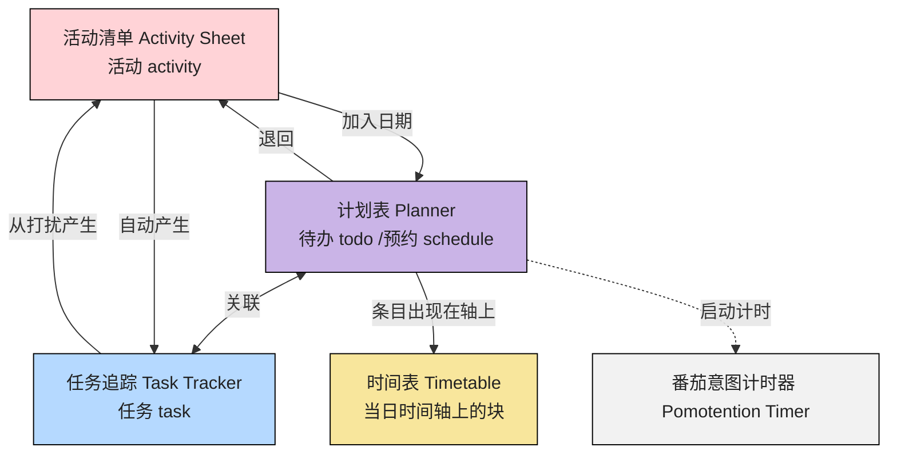

# 模块联动

::: tip

- 模块分区与顶栏入口见 [软件界面](./interface.md)
- 术语见 [附录：术语对照表](../appendix/glossary.md)
- 周期长、目标可能变化时如何用活动清单 + 任务清单当 backlog，见 [长期事项与待办库存](../practices/long-horizon-inventory.md)
  :::

## 快速导航

- 我想先看全局数据流：见 [区域之间的数据流](#区域之间的数据流)
- 从生命周期理解联动： [从活动开始](#从活动开始) [从待办或预约开始](#从待办或预约开始) [从任务开始](#从任务开始（仅支持手机）)

## 区域之间的数据流

### 模块分工

- `活动清单`：管理“有哪些事项”，负责收集、拆分与整理。
- `任务追踪`：管理“全过程发生了什么”，负责过程记录与反思。
- `计划表`：管理“哪天执行”，负责日/周/月时间语义。
- `时间表`：管理“当天何时做”，负责 24h 时间轴占位。
- `番茄时钟`：管理“专注与休息节奏”，负责计时情境支持。

### 模块规则说明

- `活动清单 → 任务追踪`：当一个意图成为活动就会自动产生一条关联的任务。
- `活动清单 ↔ 计划表`：活动放入具体日期或退回清单，活动、任务和待办/预约相互关联。
- `计划表 → 时间表`：已排事项进入当天轴，再做时段级调整。
- `计划表` 支持日/周/月/年切换，和 `时间表` 的单日轴互补。
- `番茄时钟` 可与追踪并行，增强执行过程的节奏感。

## 生命周期视角

### 从活动开始

1. 在 `活动清单 Activity Sheet` 记录事项，形成 `活动 activity`。
2. 将事项纳入 `计划表 Planner`，形成 `待办 todo` 或 `预约 schedule`。
3. 在 `时间表 Timetable` 为当天安排具体时段。
4. 在 `任务追踪 Task Tracker` 记录 `任务 task` 执行过程、状态与打断。
5. 执行中出现的新想法可回写为新 `活动 activity`，进入下一轮。
6. 在 `计划表` 勾选完成，在 `活动清单` 事项隐藏。

### 从待办或预约开始

1. 在显示日期的`计划表`，形成 `todo` 或 `schedule`。
2. 并在 `活动清单` 形成对应的 `activity`，在 `任务追踪` 形成对应的 `task`。
3. 后续操作同上。

### 从任务开始（仅支持手机）

1. 在 `任务追踪` 通过添加当下的能量值、愉悦值和描述，快速产生一个 `todo` 和 `activity`，并当下标记完成。
2. 如果有更多描述，在 `任务追踪` 书写区编辑记录。
