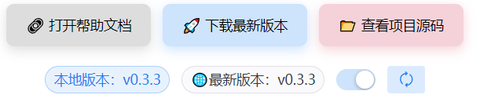

# 桌面客户端安装

::: tip 本文档管什么
**只管**：从 GitHub 下载 **Windows / macOS 安装包**、系统要求、首次安装、桌面端自动更新，以及**与安装包相关**的下载失败、清除数据重装等。

**不管**：在浏览器里打开站点、页面加载与缓存类问题 —— 请先参阅 [PWA 快速安装](/pwa-getting-started) 。
:::

## 当前版本

::: info 最新发布
**版本 v0.6.4** · 2026 年 4 月 2 日
:::

- [完整更新日志](dev-log/CHANGELOG.md)

## 系统要求

### Windows

- Windows 10 或更高版本
- 64 位系统

### macOS

- macOS 13.0 (Ventura) 或更高版本
- webkit 支持不完全导致 macOS 12.0 可安装，部分渲染失败
- Intel 或 Apple Silicon 处理器

## 下载链接

- Windows
  - [v0.6.4 .msi 安装包](https://github.com/Xeonilian/pomotention/releases/download/v0.6.4/Pomotention_0.6.4_x64_en-US.msi)

- macOS
  - [v0.6.4 .dmg 安装包](https://github.com/Xeonilian/pomotention/releases/download/v0.6.4/Pomotention_0.6.4_x64.dmg)

## 安装指南

### Windows 安装

1. 下载 `.msi` 安装包
2. 双击运行安装程序
3. 按照向导完成安装
4. 从开始菜单启动应用

### macOS 安装

1. 下载 `.dmg` 文件
2. 双击打开磁盘映像
3. 将应用拖拽到 Applications 文件夹
4. 从 Launchpad 或 Applications 启动

::: warning 安全设置

- macOS 首次运行时，需要在"系统偏好设置 > 安全性与隐私"中允许应用运行
- Windows 下载或安装时，若出现安全警告（如“阻止下载”或“Windows 已保护您的电脑”），请点击“仍要保留”/“更多信息”→“仍要运行”，以继续下载和安装。

:::

## 自动更新

- 软件提供自动更新检测，由于网络原因可能下载失败。

- 软件帮助页面提供更新信息
  - 比较本地和云端版本
  - 打开和关闭自动更新
  - 点击下载最新版本，进入最新版本页面
    

## 遇到问题

### 下载与安装

1. **下载失败**：先检查网络连接，或改用下载工具。若怀疑同步或首次启动拉取失败，可稍后再试（参见更新日志中初始化顺序与同步相关修复）。**设置**里可对当前网络环境做连通性测试。
2. **安装报错**：确认系统版本符合要求；**Windows 7** 暂不支持。
3. **安装中断**：在 **Windows** 上可从任务管理器结束相关进程后重试安装。
4. **清除本地数据或重装前**：需要时可到 **设置** 中执行本地数据清除后再安装/启动。**清除前请先导出或备份**本地数据，以免丢失。

### 网页版：白屏、一直加载

与 **浏览器缓存、网络首次拉取** 相关的问题，可先 **强制刷新**（Windows / Linux：`Ctrl + Shift + R`；macOS：`⌘ + Shift + R`），或在浏览器设置中 **清除 pomotention.pages.dev 的站点数据** 后重试；仍异常时请换网络或换浏览器对照。更多入口说明见 [快速安装](/getting-started)。

**桌面 Tauri 窗口**若出现类似现象，除尝试应用菜单中的「重新加载」外，亦可按上文 **强制刷新** 思路排查（以当前 WebView 是否响应快捷键为准）。
