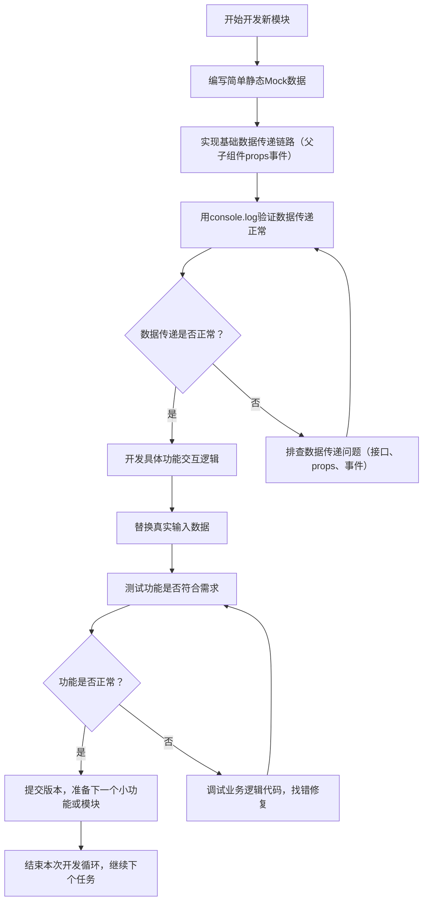

软件的模块开发流程
1. 明确模块责任边界

```mermaid
flowchart TD  
    A[开始开发新模块] --> B[编写简单静态Mock数据]  
    B --> C[实现基础数据传递链路（父子组件props事件）]  
    C --> D[用console.log验证数据传递正常]  
    D --> E{数据传递是否正常？}  
    E -- 是 --> F[开发具体功能交互逻辑]  
    E -- 否 --> G[排查数据传递问题（接口、props、事件）]  
    G --> D  
    F --> H[替换真实输入数据]  
    H --> I[测试功能是否符合需求]  
    I --> J{功能是否正常？}  
    J -- 是 --> K[提交版本，准备下一个小功能或模块]  
    J -- 否 --> L[调试业务逻辑代码，找错修复]  
    L --> I  
    K --> M[结束本次开发循环，继续下个任务]  
```